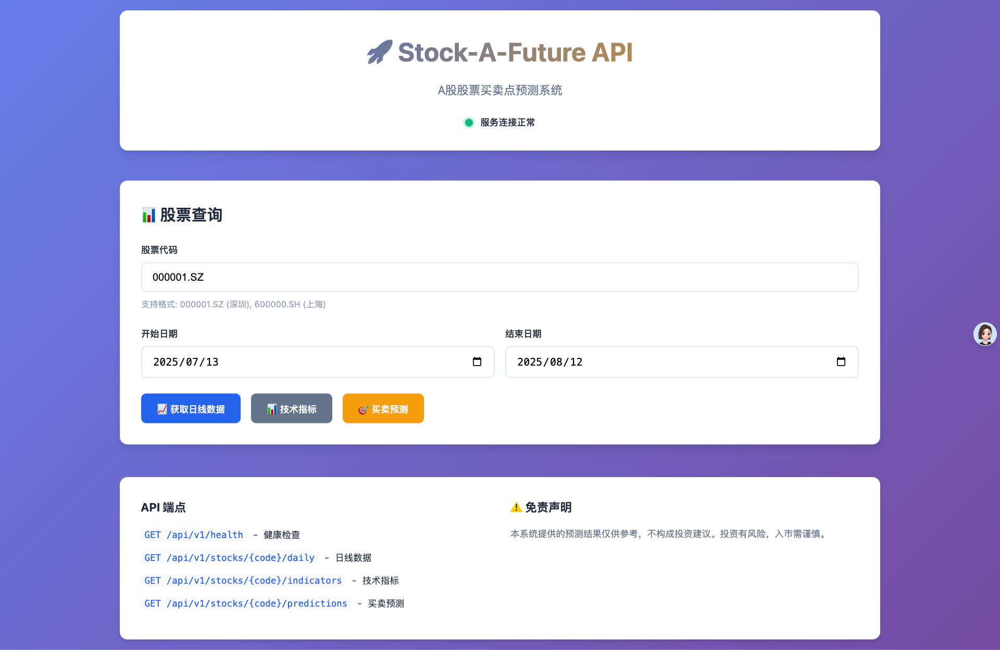
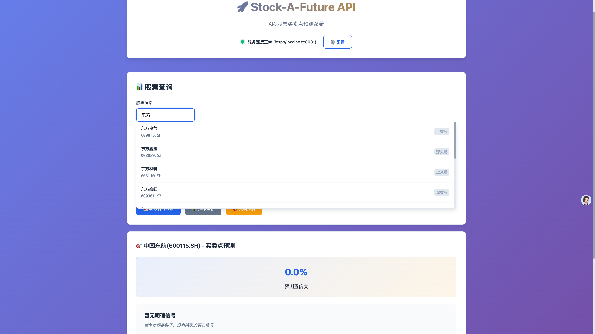

# Stock-A-Future - A股股票买卖点预测API



基于Go语言开发的A股股票买卖点预测系统，使用Tushare作为数据源，提供技术指标计算和买卖点预测功能。

## 功能特性

### 📊 数据获取
- 集成Tushare API，获取A股实时和历史数据
- 支持股票日线数据查询
- 自动数据预处理和清洗
- **股票列表工具**：支持从上交所在线获取最新股票列表
- **深交所数据**：使用本地Excel文件（`data/A股列表.xlsx`）提供完整深交所股票数据

### 📈 技术指标计算
- **MACD** - 指数平滑异同平均线，识别趋势转折
- **RSI** - 相对强弱指数，判断超买超卖
- **布林带** - 价格波动区间分析
- **移动平均线** - MA5/MA10/MA20/MA60/MA120多周期均线
- **KDJ** - 随机指标，短期买卖信号

### 🎯 智能预测
- 基于多指标综合分析的买卖点预测
- 预测概率和置信度计算
- 详细的预测理由说明
- 支持多时间周期预测

### 🚀 RESTful API
- 完整的REST API接口
- JSON格式数据交换
- CORS支持，便于前端集成
- 详细的错误处理和日志记录

### 🌐 Web界面
- **专业K线图**: 使用ECharts显示完整的OHLC数据
- **技术指标叠加**: MA5/MA10/MA20移动平均线
- **成交量副图**: 底部显示成交量柱状图，颜色与K线联动
- **智能搜索**: 支持股票名称和代码实时搜索
- **响应式设计**: 自适应桌面端和移动端
- **交互体验**: 缩放、平移、十字光标等专业功能

## 快速开始

### 环境要求
- Go 1.22+
- Tushare Pro账号和Token

### 安装步骤

1. **克隆项目**
   ```bash
   git clone <repository-url>
   cd stock-a-future
   ```

2. **安装依赖**
   ```bash
   make deps
   ```

3. **配置环境变量**
   ```bash
   make env
   # 编辑.env文件，填入您的Tushare Token
   vim .env
   ```

4. **获取股票列表（可选）**
   ```bash
   # 获取上交所股票列表
   make fetch-sse
   
   # 获取所有股票列表（上交所在线获取 + 深交所Excel文件）
   make fetch-stocks
   ```
   
   > **注意**：深交所股票数据已包含在 `data/A股列表.xlsx` 文件中，无需在线获取。

5. **启动服务**
   ```bash
   # 开发模式
   make dev
   
   # 或者构建后运行
   make build
   make run
   ```

服务将在 `http://localhost:8081` 启动。

6. **使用Web界面**
   - 打开浏览器访问 `examples/index.html`
   - 配置服务器地址为 `http://localhost:8081`
   - 使用智能搜索框输入股票名称或代码（如：平安银行、000001）
   - 选择股票后查看专业K线图和技术指标

## API文档

### 基础信息
- **Base URL**: `http://localhost:8081`
- **Content-Type**: `application/json`

### 接口列表

#### 1. 健康检查
```http
GET /api/v1/health
```

**响应示例**:
```json
{
  "success": true,
  "data": {
    "status": "healthy",
    "timestamp": "2024-01-15T10:30:00Z",
    "version": "1.0.0",
    "services": {
      "tushare": "healthy"
    }
  }
}
```

#### 2. 获取股票日线数据
```http
GET /api/v1/stocks/{code}/daily?start_date=20240101&end_date=20240131
```

**参数说明**:
- `code`: 股票代码 (如: 000001.SZ, 600000.SH)
- `start_date`: 开始日期 (YYYYMMDD格式，可选)
- `end_date`: 结束日期 (YYYYMMDD格式，可选)

**响应示例**:
```json
{
  "success": true,
  "data": [
    {
      "ts_code": "000001.SZ",
      "trade_date": "20240115",
      "open": 8.75,
      "high": 8.85,
      "low": 8.69,
      "close": 8.70,
      "pre_close": 8.72,
      "change": -0.02,
      "pct_chg": -0.23,
      "vol": 525152.77,
      "amount": 460697.377
    }
  ]
}
```

#### 3. 获取技术指标
```http
GET /api/v1/stocks/{code}/indicators
```

**响应示例**:
```json
{
  "success": true,
  "data": {
    "ts_code": "000001.SZ",
    "trade_date": "20240115",
    "macd": {
      "dif": 0.05,
      "dea": 0.03,
      "macd": 0.04,
      "signal": "BUY"
    },
    "rsi": {
      "rsi6": 45.2,
      "rsi12": 48.5,
      "rsi24": 52.1,
      "signal": "HOLD"
    },
    "boll": {
      "upper": 9.20,
      "middle": 8.70,
      "lower": 8.20,
      "signal": "HOLD"
    }
  }
}
```

#### 4. 获取股票基本信息
```http
GET /api/v1/stocks/{code}/basic
```

**响应示例**:
```json
{
  "success": true,
  "data": {
    "ts_code": "000001.SZ",
    "symbol": "000001",
    "name": "平安银行",
    "area": "深圳",
    "industry": "银行",
    "market": "SZ",
    "list_date": "19910403"
  }
}
```

#### 5. 搜索股票
```http
GET /api/v1/stocks/search?q={keyword}&limit={limit}
```

**参数说明**:
- `q`: 搜索关键词 (股票名称或代码)
- `limit`: 返回结果数量限制 (可选，默认10，最大50)

**响应示例**:
```json
{
  "success": true,
  "data": {
    "keyword": "平安",
    "total": 3,
    "stocks": [
      {
        "ts_code": "000001.SZ",
        "symbol": "000001",
        "name": "平安银行",
        "market": "SZ"
      },
      {
        "ts_code": "601318.SH",
        "symbol": "601318",
        "name": "中国平安",
        "market": "SH"
      }
    ]
  }
}
```

#### 6. 获取股票列表
```http
GET /api/v1/stocks
```

**响应示例**:
```json
{
  "success": true,
  "data": {
    "total": 8950,
    "stocks": [
      {
        "ts_code": "000001.SZ",
        "symbol": "000001",
        "name": "平安银行",
        "market": "SZ"
      }
    ]
  }
}
```

#### 7. 获取买卖点预测
```http
GET /api/v1/stocks/{code}/predictions
```

**响应示例**:
```json
{
  "success": true,
  "data": {
    "ts_code": "000001.SZ",
    "trade_date": "20240115",
    "predictions": [
      {
        "type": "BUY",
        "price": 8.70,
        "date": "20240116",
        "probability": 0.65,
        "reason": "MACD金叉信号，DIF线上穿DEA线",
        "indicators": ["MACD"]
      }
    ],
    "confidence": 0.68,
    "updated_at": "2024-01-15T10:30:00Z"
  }
}
```

## 技术架构

### 项目结构
```
stock-a-future/
├── cmd/
│   ├── server/          # 主应用程序入口
│   └── stocklist/       # 股票列表获取工具
├── config/              # 配置管理
├── data/                # 数据文件
│   └── A股列表.xlsx      # 深交所股票列表（Excel格式）
├── internal/            # 内部包
│   ├── client/          # API客户端（Tushare + 交易所）
│   ├── handler/         # HTTP处理器
│   ├── indicators/      # 技术指标计算
│   ├── models/          # 数据模型
│   └── service/         # 业务逻辑服务
├── docs/                # 项目文档
├── examples/            # 使用示例
├── Makefile            # 构建脚本
└── README.md           # 项目文档
```

### 技术栈
- **语言**: Go 1.22
- **HTTP框架**: 标准库 net/http + ServeMux
- **数据源**: Tushare Pro API + 交易所官网 + 本地Excel文件
- **数值计算**: shopspring/decimal
- **配置管理**: godotenv

### 核心算法

#### 买卖点预测逻辑
1. **多指标综合分析**: 结合MACD、RSI、布林带、KDJ、移动平均线
2. **概率计算**: 基于指标强度和历史表现计算预测概率
3. **置信度评估**: 根据信号一致性评估整体置信度
4. **风险控制**: 设置概率阈值，过滤低质量信号

#### 技术指标实现
- **精确计算**: 使用decimal库确保金融计算精度
- **标准算法**: 严格按照技术分析标准公式实现
- **性能优化**: 高效的滑动窗口算法

## 开发指南

### 本地开发

#### 开发工具和代码质量
```bash
# 安装开发工具
make tools

# 代码格式化
make fmt

# 代码检查
make vet

# 运行测试
make test

# 代码质量检查
make lint
```

#### 服务器管理
```bash
# 检查服务器状态
make status

# 开发模式启动
make dev

# 停止服务器
make stop

# 强制停止服务器
make kill

# 重启服务器
make restart
```

#### 构建和部署
```bash
# 下载依赖
make deps

# 构建应用程序
make build

# 构建并运行
make run

# 清理构建文件
make clean
```

#### 数据管理
```bash
# 获取上交所股票列表
make fetch-sse

# 获取所有股票列表
make fetch-stocks

# 构建股票列表工具
make stocklist
```

### 环境配置
创建`.env`文件：
```bash
TUSHARE_TOKEN=your_tushare_token_here
TUSHARE_BASE_URL=http://api.tushare.pro
SERVER_PORT=8081
SERVER_HOST=localhost
LOG_LEVEL=info
```

### 部署
```bash
# 构建生产版本
make build

# 运行
./bin/stock-a-future
```

## 功能展示

### 🖥️ Web界面特性

#### K线图升级
- **从简单折线图到专业K线图**: 显示完整的开盘、最高、最低、收盘价
- **红绿涨跌色彩**: 红色阳线表示上涨，绿色阴线表示下跌
- **成交量联动**: 底部成交量柱状图，颜色与K线保持一致
- **技术指标叠加**: 自动计算并显示MA5、MA10、MA20移动平均线

#### 智能搜索功能



- **实时搜索**: 输入股票名称或代码，300ms防抖搜索
- **模糊匹配**: 支持部分匹配，如输入"平安"可找到"平安银行"、"中国平安"
- **键盘导航**: 支持上下箭头键选择，回车确认
- **自动填充**: 选择搜索结果后自动填入股票代码框

#### 交互体验
- **图表缩放**: 鼠标滚轮缩放，拖拽平移
- **数据提示**: 鼠标悬停显示详细的OHLC数据、成交量、涨跌幅
- **响应式设计**: 自适应不同屏幕尺寸
- **数据摘要**: 显示8个关键指标（收盘价、成交量、振幅等）

### 🔧 服务器管理

新增的Make命令让服务器管理更加便捷：

```bash
# 检查服务器状态（显示进程和端口占用）
make status

# 优雅停止服务器
make stop

# 强制停止（包括端口清理）
make kill

# 一键重启
make restart
```

## 使用示例

### cURL示例
```bash
# 健康检查
curl http://localhost:8081/api/v1/health

# 获取平安银行日线数据
curl "http://localhost:8081/api/v1/stocks/000001.SZ/daily?start_date=20240101&end_date=20240131"

# 获取股票基本信息
curl http://localhost:8081/api/v1/stocks/000001.SZ/basic

# 搜索股票
curl "http://localhost:8081/api/v1/stocks/search?q=平安&limit=5"

# 获取股票列表
curl http://localhost:8081/api/v1/stocks

# 获取技术指标
curl http://localhost:8081/api/v1/stocks/000001.SZ/indicators

# 获取买卖点预测
curl http://localhost:8081/api/v1/stocks/000001.SZ/predictions
```

### Python示例
```python
import requests

# 基础配置
base_url = "http://localhost:8081"
stock_code = "000001.SZ"

# 1. 搜索股票
def search_stocks(keyword):
    response = requests.get(f"{base_url}/api/v1/stocks/search", 
                          params={"q": keyword, "limit": 5})
    data = response.json()
    if data["success"]:
        print(f"搜索 '{keyword}' 的结果:")
        for stock in data["data"]["stocks"]:
            print(f"  {stock['name']} ({stock['ts_code']}) - {stock['market']}")
        return data["data"]["stocks"]
    return []

# 2. 获取股票基本信息
def get_stock_basic(stock_code):
    response = requests.get(f"{base_url}/api/v1/stocks/{stock_code}/basic")
    data = response.json()
    if data["success"]:
        stock = data["data"]
        print(f"股票信息: {stock['name']} ({stock['ts_code']})")
        print(f"所属市场: {stock['market']}, 行业: {stock.get('industry', 'N/A')}")
        return stock
    return None

# 3. 获取日线数据
def get_daily_data(stock_code, start_date="20250101", end_date="20250131"):
    response = requests.get(f"{base_url}/api/v1/stocks/{stock_code}/daily",
                          params={"start_date": start_date, "end_date": end_date})
    data = response.json()
    if data["success"]:
        daily_data = data["data"]
        print(f"获取到 {len(daily_data)} 条日线数据")
        if daily_data:
            latest = daily_data[-1]
            print(f"最新数据 ({latest['trade_date']}): 收盘价 {latest['close']}")
        return daily_data
    return []

# 4. 获取预测结果
def get_predictions(stock_code):
    response = requests.get(f"{base_url}/api/v1/stocks/{stock_code}/predictions")
    data = response.json()
    if data["success"]:
        predictions = data["data"]["predictions"]
        confidence = data["data"]["confidence"]
        print(f"预测置信度: {confidence:.2%}")
        for pred in predictions:
            print(f"预测类型: {pred['type']}")
            print(f"预测价格: {pred['price']}")
            print(f"预测概率: {pred['probability']:.2%}")
            print(f"预测理由: {pred['reason']}")
            print("---")
        return predictions
    return []

# 使用示例
if __name__ == "__main__":
    # 搜索包含"平安"的股票
    stocks = search_stocks("平安")
    
    if stocks:
        # 使用第一个搜索结果
        stock_code = stocks[0]["ts_code"]
        
        # 获取基本信息
        get_stock_basic(stock_code)
        
        # 获取日线数据
        get_daily_data(stock_code)
        
        # 获取预测结果
        get_predictions(stock_code)
```

## 注意事项

### Tushare使用限制
- 需要注册Tushare Pro账号获取Token
- 免费账号有调用频率限制
- 部分高级数据需要积分

### 风险提示
- 本系统仅供学习和研究使用
- 预测结果不构成投资建议
- 股市有风险，投资需谨慎
- 请根据自身情况做出投资决策

### 性能考虑
- 技术指标计算需要足够的历史数据
- 建议为计算密集型操作添加缓存
- 生产环境建议使用数据库存储历史数据

## 重要配置说明

### 开始使用前的必要步骤

**⚠️ 需要注意的是，您需要：**

1. **获取Tushare API Token**
   - 访问 [Tushare官网](https://tushare.pro) 注册账号
   - 在个人中心获取您的API Token
   - 免费账号有一定的调用限制，请合理使用

2. **配置环境变量**
   ```bash
   # 复制配置文件模板
   cp .env.example .env
   
   # 编辑.env文件，将your_tushare_token_here替换为您的真实Token
   vim .env
   ```

3. **验证配置**
   ```bash
   # 启动服务
   make dev
   
   # 在另一个终端测试健康检查
   curl http://localhost:8081/api/v1/health
   ```

如果健康检查显示Tushare服务状态为"healthy"，说明配置成功。

## 📈 更新日志

### 2025-08-13

#### 🆕 新增功能
- **专业K线图**: 升级前端图表为ECharts，支持完整OHLC显示
- **智能股票搜索**: 新增股票名称和代码搜索API和前端界面
- **服务器管理命令**: 新增 `make stop/kill/status/restart` 命令
- **成交量副图**: K线图下方显示成交量柱状图
- **技术指标叠加**: 自动显示MA5/MA10/MA20移动平均线

#### 🔧 改进优化
- **端口更新**: 默认端口从8080改为8081，避免常见冲突
- **数据摘要增强**: 显示8个关键指标（成交额、振幅等）
- **交互体验**: 支持图表缩放、平移、键盘导航
- **响应式设计**: 优化移动端显示效果
- **错误处理**: 改进API错误处理和用户反馈

#### 🐛 修复问题
- 修复图表数据格式化问题
- 优化搜索性能和防抖处理
- 改进服务器进程管理和端口检测

#### 📚 文档更新
- 更新所有API示例和端口号
- 新增服务器管理指南
- 完善Python使用示例
- 添加功能展示说明

### 2025-08-12

#### 🆕 新增功能
- **本地股票数据服务**: 支持从Excel文件读取深交所股票数据
- **混合数据源架构**: 上交所在线获取 + 深交所本地Excel文件
- **股票列表获取工具**: 支持多种数据源选择（sse/all）
- **智能列映射**: 自动识别Excel文件中的股票代码和名称列

#### 🔧 改进优化
- **智能端口检测**: 自动尝试常见端口（8081, 8080, 3000, 8000, 9000）
- **配置管理界面**: 前端配置按钮，支持手动设置服务器地址
- **自动故障转移**: 连接失败时自动尝试其他端口
- **数据排序优化**: 修复日线数据时间轴显示问题
- **进程管理增强**: 改进make命令的进程识别和端口检测

#### 🐛 修复问题
- 修复前端日期解析"Invalid Date"问题
- 修复JSON序列化中decimal类型问题
- 修复日线数据时间排序问题（从左到右正确增长）
- 优化端口占用检测和进程清理

#### 📚 文档更新
- 新增股票列表获取工具文档
- 更新项目结构和技术栈说明
- 完善服务器管理命令说明

### 2025-08-12 (早期)

#### 🆕 新增功能
- **交易所客户端**: 支持获取上交所和深交所股票列表
- **命令行工具**: 支持多种数据源选择和配置
- **Makefile集成**: 新增股票列表相关构建命令

#### 🔧 改进优化
- **智能配置读取**: 自动从.env文件读取配置
- **命令行参数支持**: 支持端口和主机地址配置
- **测试脚本优化**: 自动适配配置文件中的端口设置

### 初始版本
- 初始版本发布
- 基础API功能
- 技术指标计算
- 简单前端界面

## 贡献指南

1. Fork 本项目
2. 创建功能分支 (`git checkout -b feature/AmazingFeature`)
3. 提交更改 (`git commit -m 'Add some AmazingFeature'`)
4. 推送到分支 (`git push origin feature/AmazingFeature`)
5. 开启 Pull Request

## 许可证

本项目采用 MIT 许可证 - 查看 [LICENSE](LICENSE) 文件了解详情

## 联系方式

- 项目地址: [GitHub Repository]
- 问题反馈: [Issues]
- 文档: [Wiki]

---

**免责声明**: 本项目仅用于技术学习和研究目的，不构成任何投资建议。使用者应当自行承担投资风险。