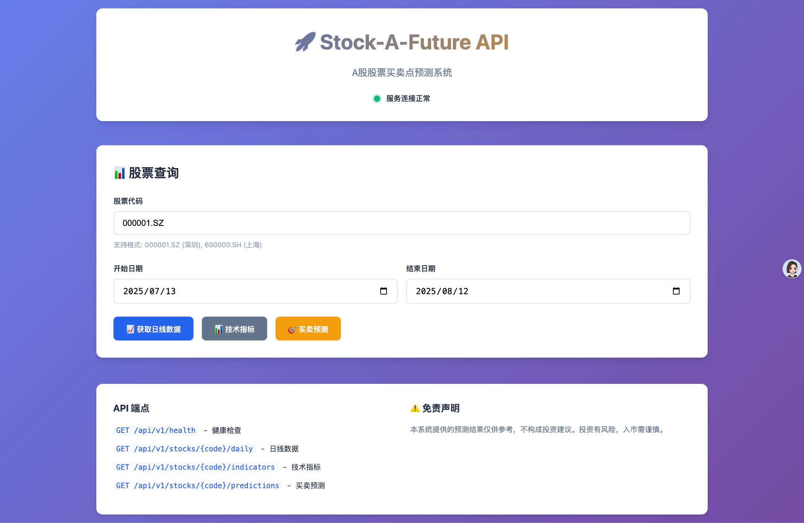

# Stock-A-Future - A股股票买卖点预测API



基于Go语言开发的A股股票买卖点预测系统，使用Tushare作为数据源，提供技术指标计算和买卖点预测功能。

## 功能特性

### 📊 数据获取
- 集成Tushare API，获取A股实时和历史数据
- 支持股票日线数据查询
- 自动数据预处理和清洗

### 📈 技术指标计算
- **MACD** - 指数平滑异同平均线，识别趋势转折
- **RSI** - 相对强弱指数，判断超买超卖
- **布林带** - 价格波动区间分析
- **移动平均线** - MA5/MA10/MA20/MA60/MA120多周期均线
- **KDJ** - 随机指标，短期买卖信号

### 🎯 智能预测
- 基于多指标综合分析的买卖点预测
- 预测概率和置信度计算
- 详细的预测理由说明
- 支持多时间周期预测

### 🚀 RESTful API
- 完整的REST API接口
- JSON格式数据交换
- CORS支持，便于前端集成
- 详细的错误处理和日志记录

## 快速开始

### 环境要求
- Go 1.22+
- Tushare Pro账号和Token

### 安装步骤

1. **克隆项目**
   ```bash
   git clone <repository-url>
   cd stock-a-future
   ```

2. **安装依赖**
   ```bash
   make deps
   ```

3. **配置环境变量**
   ```bash
   make env
   # 编辑.env文件，填入您的Tushare Token
   vim .env
   ```

4. **启动服务**
   ```bash
   # 开发模式
   make dev
   
   # 或者构建后运行
   make build
   make run
   ```

服务将在 `http://localhost:8080` 启动。

## API文档

### 基础信息
- **Base URL**: `http://localhost:8080`
- **Content-Type**: `application/json`

### 接口列表

#### 1. 健康检查
```http
GET /api/v1/health
```

**响应示例**:
```json
{
  "success": true,
  "data": {
    "status": "healthy",
    "timestamp": "2024-01-15T10:30:00Z",
    "version": "1.0.0",
    "services": {
      "tushare": "healthy"
    }
  }
}
```

#### 2. 获取股票日线数据
```http
GET /api/v1/stocks/{code}/daily?start_date=20240101&end_date=20240131
```

**参数说明**:
- `code`: 股票代码 (如: 000001.SZ, 600000.SH)
- `start_date`: 开始日期 (YYYYMMDD格式，可选)
- `end_date`: 结束日期 (YYYYMMDD格式，可选)

**响应示例**:
```json
{
  "success": true,
  "data": [
    {
      "ts_code": "000001.SZ",
      "trade_date": "20240115",
      "open": 8.75,
      "high": 8.85,
      "low": 8.69,
      "close": 8.70,
      "pre_close": 8.72,
      "change": -0.02,
      "pct_chg": -0.23,
      "vol": 525152.77,
      "amount": 460697.377
    }
  ]
}
```

#### 3. 获取技术指标
```http
GET /api/v1/stocks/{code}/indicators
```

**响应示例**:
```json
{
  "success": true,
  "data": {
    "ts_code": "000001.SZ",
    "trade_date": "20240115",
    "macd": {
      "dif": 0.05,
      "dea": 0.03,
      "macd": 0.04,
      "signal": "BUY"
    },
    "rsi": {
      "rsi6": 45.2,
      "rsi12": 48.5,
      "rsi24": 52.1,
      "signal": "HOLD"
    },
    "boll": {
      "upper": 9.20,
      "middle": 8.70,
      "lower": 8.20,
      "signal": "HOLD"
    }
  }
}
```

#### 4. 获取买卖点预测
```http
GET /api/v1/stocks/{code}/predictions
```

**响应示例**:
```json
{
  "success": true,
  "data": {
    "ts_code": "000001.SZ",
    "trade_date": "20240115",
    "predictions": [
      {
        "type": "BUY",
        "price": 8.70,
        "date": "20240116",
        "probability": 0.65,
        "reason": "MACD金叉信号，DIF线上穿DEA线",
        "indicators": ["MACD"]
      }
    ],
    "confidence": 0.68,
    "updated_at": "2024-01-15T10:30:00Z"
  }
}
```

## 技术架构

### 项目结构
```
stock-a-future/
├── cmd/server/          # 应用程序入口
├── config/              # 配置管理
├── internal/            # 内部包
│   ├── client/          # Tushare API客户端
│   ├── handler/         # HTTP处理器
│   ├── indicators/      # 技术指标计算
│   ├── models/          # 数据模型
│   └── service/         # 业务逻辑服务
├── Makefile            # 构建脚本
└── README.md           # 项目文档
```

### 技术栈
- **语言**: Go 1.22
- **HTTP框架**: 标准库 net/http + ServeMux
- **数据源**: Tushare Pro API
- **数值计算**: shopspring/decimal
- **配置管理**: godotenv

### 核心算法

#### 买卖点预测逻辑
1. **多指标综合分析**: 结合MACD、RSI、布林带、KDJ、移动平均线
2. **概率计算**: 基于指标强度和历史表现计算预测概率
3. **置信度评估**: 根据信号一致性评估整体置信度
4. **风险控制**: 设置概率阈值，过滤低质量信号

#### 技术指标实现
- **精确计算**: 使用decimal库确保金融计算精度
- **标准算法**: 严格按照技术分析标准公式实现
- **性能优化**: 高效的滑动窗口算法

## 开发指南

### 本地开发
```bash
# 安装开发工具
make tools

# 代码格式化
make fmt

# 代码检查
make vet

# 运行测试
make test

# 代码质量检查
make lint
```

### 环境配置
创建`.env`文件：
```bash
TUSHARE_TOKEN=your_tushare_token_here
TUSHARE_BASE_URL=http://api.tushare.pro
SERVER_PORT=8080
SERVER_HOST=localhost
LOG_LEVEL=info
```

### 部署
```bash
# 构建生产版本
make build

# 运行
./bin/stock-a-future
```

## 使用示例

### cURL示例
```bash
# 健康检查
curl http://localhost:8080/api/v1/health

# 获取平安银行日线数据
curl "http://localhost:8080/api/v1/stocks/000001.SZ/daily?start_date=20240101&end_date=20240131"

# 获取技术指标
curl http://localhost:8080/api/v1/stocks/000001.SZ/indicators

# 获取买卖点预测
curl http://localhost:8080/api/v1/stocks/000001.SZ/predictions
```

### Python示例
```python
import requests

# 基础配置
base_url = "http://localhost:8080"
stock_code = "000001.SZ"

# 获取预测结果
response = requests.get(f"{base_url}/api/v1/stocks/{stock_code}/predictions")
data = response.json()

if data["success"]:
    predictions = data["data"]["predictions"]
    for pred in predictions:
        print(f"预测类型: {pred['type']}")
        print(f"预测价格: {pred['price']}")
        print(f"预测概率: {pred['probability']}")
        print(f"预测理由: {pred['reason']}")
        print("---")
```

## 注意事项

### Tushare使用限制
- 需要注册Tushare Pro账号获取Token
- 免费账号有调用频率限制
- 部分高级数据需要积分

### 风险提示
- 本系统仅供学习和研究使用
- 预测结果不构成投资建议
- 股市有风险，投资需谨慎
- 请根据自身情况做出投资决策

### 性能考虑
- 技术指标计算需要足够的历史数据
- 建议为计算密集型操作添加缓存
- 生产环境建议使用数据库存储历史数据

## 重要配置说明

### 开始使用前的必要步骤

**⚠️ 需要注意的是，您需要：**

1. **获取Tushare API Token**
   - 访问 [Tushare官网](https://tushare.pro) 注册账号
   - 在个人中心获取您的API Token
   - 免费账号有一定的调用限制，请合理使用

2. **配置环境变量**
   ```bash
   # 复制配置文件模板
   cp .env.example .env
   
   # 编辑.env文件，将your_tushare_token_here替换为您的真实Token
   vim .env
   ```

3. **验证配置**
   ```bash
   # 启动服务
   make dev
   
   # 在另一个终端测试健康检查
   curl http://localhost:8080/api/v1/health
   ```

如果健康检查显示Tushare服务状态为"healthy"，说明配置成功。

## 贡献指南

1. Fork 本项目
2. 创建功能分支 (`git checkout -b feature/AmazingFeature`)
3. 提交更改 (`git commit -m 'Add some AmazingFeature'`)
4. 推送到分支 (`git push origin feature/AmazingFeature`)
5. 开启 Pull Request

## 许可证

本项目采用 MIT 许可证 - 查看 [LICENSE](LICENSE) 文件了解详情

## 联系方式

- 项目地址: [GitHub Repository]
- 问题反馈: [Issues]
- 文档: [Wiki]

---

**免责声明**: 本项目仅用于技术学习和研究目的，不构成任何投资建议。使用者应当自行承担投资风险。