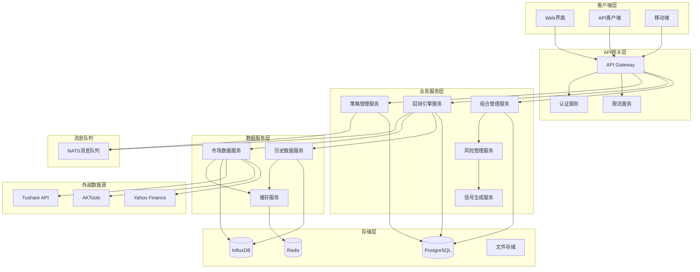

# 股票量化策略回测系统设计文档

## 📋 目录
- [系统概述](#系统概述)
- [核心架构](#核心架构)
- [模块设计](#模块设计)
- [数据模型](#数据模型)
- [API接口设计](#api接口设计)
- [性能优化](#性能优化)
- [部署架构](#部署架构)

---

## 🎯 系统概述

### 设计目标
构建一个高性能、可扩展的股票量化策略回测系统，支持多种策略类型、多时间周期回测，并提供详细的性能分析和风险评估。

### 核心特性
- ✅ **多策略支持**: 技术指标策略、机器学习策略、复合策略
- ✅ **高精度回测**: 精确到分钟级别的历史数据回测
- ✅ **实时监控**: 策略实时运行状态监控
- ✅ **风险管理**: 完整的风险控制和资金管理
- ✅ **性能分析**: 详细的回测报告和可视化分析
- ✅ **并发处理**: 支持多策略并行回测

### 技术栈
- **后端**: Go 1.22+ (net/http + ServeMux)
- **数据库**: PostgreSQL (主库) + Redis (缓存)
- **时序数据**: InfluxDB (高频数据存储)
- **消息队列**: NATS (策略执行调度)
- **前端**: React + TypeScript + ECharts

---

## 🏗️ 核心架构

### 系统架构图



### 分层架构

#### 1. 表现层 (Presentation Layer)
- **Web前端**: React + TypeScript构建的SPA应用
- **移动端**: React Native或PWA
- **API文档**: Swagger/OpenAPI自动生成

#### 2. 应用层 (Application Layer)
- **API网关**: 统一入口，负责路由、认证、限流
- **业务服务**: 微服务架构，各服务独立部署

#### 3. 领域层 (Domain Layer)
- **策略引擎**: 策略逻辑执行核心
- **回测引擎**: 历史数据回放和计算
- **风险引擎**: 实时风险监控和控制

#### 4. 基础设施层 (Infrastructure Layer)
- **数据访问**: Repository模式封装数据操作
- **消息队列**: 异步任务处理
- **缓存系统**: 高频数据缓存

---

## 🔧 模块设计

### 1. 策略管理模块 (Strategy Management)

#### 功能职责
- 策略创建、编辑、删除
- 策略版本管理
- 策略参数配置
- 策略状态管理

#### 核心组件
```go
// 策略接口定义
type Strategy interface {
    Initialize(params map[string]interface{}) error
    OnBar(bar *MarketBar) (*Signal, error)
    OnTick(tick *MarketTick) (*Signal, error)
    GetMetrics() *StrategyMetrics
    Cleanup() error
}

// 策略管理器
type StrategyManager struct {
    strategies map[string]Strategy
    config     *StrategyConfig
    logger     *logger.Logger
}
```

### 2. 回测引擎模块 (Backtest Engine)

#### 功能职责
- 历史数据回放
- 策略信号执行
- 交易成本计算
- 滑点模拟
- 性能指标计算

#### 核心组件
```go
// 回测引擎
type BacktestEngine struct {
    dataProvider DataProvider
    broker       *SimulatedBroker
    portfolio    *Portfolio
    riskManager  *RiskManager
    metrics      *PerformanceMetrics
}

// 回测配置
type BacktestConfig struct {
    StartDate    time.Time
    EndDate      time.Time
    InitialCash  decimal.Decimal
    Commission   decimal.Decimal
    Slippage     decimal.Decimal
    Benchmark    string
}
```

### 3. 组合管理模块 (Portfolio Management)

#### 功能职责
- 持仓管理
- 资金管理
- 订单管理
- 盈亏计算

#### 核心组件
```go
// 投资组合
type Portfolio struct {
    cash        decimal.Decimal
    positions   map[string]*Position
    orders      []*Order
    trades      []*Trade
    metrics     *PortfolioMetrics
}

// 持仓信息
type Position struct {
    Symbol      string
    Quantity    int64
    AvgPrice    decimal.Decimal
    MarketValue decimal.Decimal
    UnrealizedPL decimal.Decimal
}
```

### 4. 风险管理模块 (Risk Management)

#### 功能职责
- 实时风险监控
- 止损止盈控制
- 仓位控制
- 最大回撤控制

#### 核心组件
```go
// 风险管理器
type RiskManager struct {
    maxDrawdown     decimal.Decimal
    maxPositionSize decimal.Decimal
    stopLossRatio   decimal.Decimal
    takeProfitRatio decimal.Decimal
}

// 风险检查
func (rm *RiskManager) CheckRisk(order *Order, portfolio *Portfolio) error {
    // 实现风险检查逻辑
}
```

### 5. 数据管理模块 (Data Management)

#### 功能职责
- 市场数据获取
- 历史数据存储
- 数据清洗和预处理
- 数据缓存管理

#### 核心组件
```go
// 数据提供者接口
type DataProvider interface {
    GetHistoricalData(symbol string, start, end time.Time) ([]*MarketBar, error)
    GetRealtimeData(symbol string) (*MarketTick, error)
    Subscribe(symbols []string, callback func(*MarketTick)) error
}

// 市场数据
type MarketBar struct {
    Symbol    string
    Timestamp time.Time
    Open      decimal.Decimal
    High      decimal.Decimal
    Low       decimal.Decimal
    Close     decimal.Decimal
    Volume    int64
}
```

---

## 📊 数据模型

### 1. 策略相关表

#### strategies (策略表)
```sql
CREATE TABLE strategies (
    id UUID PRIMARY KEY DEFAULT gen_random_uuid(),
    name VARCHAR(100) NOT NULL,
    description TEXT,
    strategy_type VARCHAR(50) NOT NULL, -- 'technical', 'ml', 'composite'
    code TEXT NOT NULL, -- 策略代码
    parameters JSONB, -- 策略参数
    status VARCHAR(20) DEFAULT 'inactive', -- 'active', 'inactive', 'testing'
    created_by UUID REFERENCES users(id),
    created_at TIMESTAMP DEFAULT NOW(),
    updated_at TIMESTAMP DEFAULT NOW()
);
```

#### strategy_versions (策略版本表)
```sql
CREATE TABLE strategy_versions (
    id UUID PRIMARY KEY DEFAULT gen_random_uuid(),
    strategy_id UUID REFERENCES strategies(id),
    version VARCHAR(20) NOT NULL,
    code TEXT NOT NULL,
    parameters JSONB,
    changelog TEXT,
    created_at TIMESTAMP DEFAULT NOW()
);
```

### 2. 回测相关表

#### backtests (回测任务表)
```sql
CREATE TABLE backtests (
    id UUID PRIMARY KEY DEFAULT gen_random_uuid(),
    name VARCHAR(100) NOT NULL,
    strategy_id UUID REFERENCES strategies(id),
    strategy_version VARCHAR(20),
    symbols TEXT[], -- 回测股票列表
    start_date DATE NOT NULL,
    end_date DATE NOT NULL,
    initial_cash DECIMAL(15,2) NOT NULL,
    commission DECIMAL(6,4) DEFAULT 0.0003,
    slippage DECIMAL(6,4) DEFAULT 0.0001,
    benchmark VARCHAR(20) DEFAULT 'HS300',
    status VARCHAR(20) DEFAULT 'pending', -- 'pending', 'running', 'completed', 'failed'
    progress INTEGER DEFAULT 0, -- 进度百分比
    created_at TIMESTAMP DEFAULT NOW(),
    started_at TIMESTAMP,
    completed_at TIMESTAMP
);
```

#### backtest_results (回测结果表)
```sql
CREATE TABLE backtest_results (
    id UUID PRIMARY KEY DEFAULT gen_random_uuid(),
    backtest_id UUID REFERENCES backtests(id),
    total_return DECIMAL(10,4),
    annual_return DECIMAL(10,4),
    max_drawdown DECIMAL(10,4),
    sharpe_ratio DECIMAL(10,4),
    sortino_ratio DECIMAL(10,4),
    win_rate DECIMAL(6,4),
    profit_factor DECIMAL(10,4),
    total_trades INTEGER,
    avg_trade_return DECIMAL(10,4),
    benchmark_return DECIMAL(10,4),
    alpha DECIMAL(10,4),
    beta DECIMAL(10,4),
    created_at TIMESTAMP DEFAULT NOW()
);
```

### 3. 交易相关表

#### trades (交易记录表)
```sql
CREATE TABLE trades (
    id UUID PRIMARY KEY DEFAULT gen_random_uuid(),
    backtest_id UUID REFERENCES backtests(id),
    symbol VARCHAR(20) NOT NULL,
    side VARCHAR(10) NOT NULL, -- 'buy', 'sell'
    quantity INTEGER NOT NULL,
    price DECIMAL(10,4) NOT NULL,
    commission DECIMAL(10,4) NOT NULL,
    timestamp TIMESTAMP NOT NULL,
    signal_type VARCHAR(50), -- 触发信号类型
    created_at TIMESTAMP DEFAULT NOW()
);
```

#### positions (持仓记录表)
```sql
CREATE TABLE positions (
    id UUID PRIMARY KEY DEFAULT gen_random_uuid(),
    backtest_id UUID REFERENCES backtests(id),
    symbol VARCHAR(20) NOT NULL,
    quantity INTEGER NOT NULL,
    avg_price DECIMAL(10,4) NOT NULL,
    market_value DECIMAL(15,2) NOT NULL,
    unrealized_pl DECIMAL(15,2) NOT NULL,
    timestamp TIMESTAMP NOT NULL,
    created_at TIMESTAMP DEFAULT NOW()
);
```

### 4. 时序数据模型 (InfluxDB)

#### 市场数据
```
measurement: market_data
tags:
  - symbol: 股票代码
  - exchange: 交易所
fields:
  - open: 开盘价
  - high: 最高价
  - low: 最低价
  - close: 收盘价
  - volume: 成交量
  - amount: 成交额
time: 时间戳
```

#### 策略信号
```
measurement: strategy_signals
tags:
  - strategy_id: 策略ID
  - symbol: 股票代码
  - signal_type: 信号类型
fields:
  - strength: 信号强度
  - confidence: 置信度
  - price: 触发价格
time: 时间戳
```

---

## 🔌 API接口设计

### 1. 策略管理API

#### 创建策略
```http
POST /api/v1/strategies
Content-Type: application/json

{
  "name": "MACD金叉策略",
  "description": "基于MACD指标的金叉死叉策略",
  "strategy_type": "technical",
  "code": "// 策略代码",
  "parameters": {
    "fast_period": 12,
    "slow_period": 26,
    "signal_period": 9
  }
}
```

**响应**:
```json
{
  "code": 200,
  "message": "策略创建成功",
  "data": {
    "id": "550e8400-e29b-41d4-a716-446655440000",
    "name": "MACD金叉策略",
    "status": "inactive",
    "created_at": "2024-01-15T10:30:00Z"
  }
}
```

#### 获取策略列表
```http
GET /api/v1/strategies?page=1&size=20&status=active
```

**响应**:
```json
{
  "code": 200,
  "message": "获取成功",
  "data": {
    "total": 50,
    "page": 1,
    "size": 20,
    "items": [
      {
        "id": "550e8400-e29b-41d4-a716-446655440000",
        "name": "MACD金叉策略",
        "strategy_type": "technical",
        "status": "active",
        "created_at": "2024-01-15T10:30:00Z"
      }
    ]
  }
}
```

### 2. 回测管理API

#### 创建回测任务
```http
POST /api/v1/backtests
Content-Type: application/json

{
  "name": "MACD策略回测-2023年",
  "strategy_id": "550e8400-e29b-41d4-a716-446655440000",
  "symbols": ["000001.SZ", "000002.SZ", "600000.SH"],
  "start_date": "2023-01-01",
  "end_date": "2023-12-31",
  "initial_cash": 1000000,
  "commission": 0.0003,
  "slippage": 0.0001,
  "benchmark": "HS300"
}
```

**响应**:
```json
{
  "code": 200,
  "message": "回测任务创建成功",
  "data": {
    "id": "660e8400-e29b-41d4-a716-446655440001",
    "name": "MACD策略回测-2023年",
    "status": "pending",
    "created_at": "2024-01-15T11:00:00Z"
  }
}
```

#### 启动回测
```http
POST /api/v1/backtests/{id}/start
```

**响应**:
```json
{
  "code": 200,
  "message": "回测任务已启动",
  "data": {
    "id": "660e8400-e29b-41d4-a716-446655440001",
    "status": "running",
    "started_at": "2024-01-15T11:05:00Z"
  }
}
```

#### 获取回测进度
```http
GET /api/v1/backtests/{id}/progress
```

**响应**:
```json
{
  "code": 200,
  "message": "获取成功",
  "data": {
    "id": "660e8400-e29b-41d4-a716-446655440001",
    "status": "running",
    "progress": 65,
    "current_date": "2023-08-15",
    "estimated_completion": "2024-01-15T11:15:00Z"
  }
}
```

#### 获取回测结果
```http
GET /api/v1/backtests/{id}/results
```

**响应**:
```json
{
  "code": 200,
  "message": "获取成功",
  "data": {
    "backtest_id": "660e8400-e29b-41d4-a716-446655440001",
    "performance": {
      "total_return": 0.2856,
      "annual_return": 0.2856,
      "max_drawdown": -0.1234,
      "sharpe_ratio": 1.45,
      "sortino_ratio": 1.78,
      "win_rate": 0.6234,
      "profit_factor": 1.89,
      "total_trades": 156,
      "avg_trade_return": 0.0183
    },
    "benchmark": {
      "total_return": 0.1234,
      "annual_return": 0.1234,
      "alpha": 0.1622,
      "beta": 0.89
    },
    "equity_curve": [
      {
        "date": "2023-01-01",
        "portfolio_value": 1000000,
        "benchmark_value": 1000000
      }
    ]
  }
}
```

### 3. 实时监控API

#### 获取策略运行状态
```http
GET /api/v1/strategies/{id}/status
```

#### 获取实时持仓
```http
GET /api/v1/portfolios/{id}/positions
```

#### 获取实时信号
```http
GET /api/v1/signals/realtime?strategy_id={id}
```

### 4. WebSocket接口

#### 实时数据推送
```javascript
// 连接WebSocket
const ws = new WebSocket('ws://localhost:8080/ws');

// 订阅回测进度
ws.send(JSON.stringify({
  type: 'subscribe',
  channel: 'backtest_progress',
  backtest_id: '660e8400-e29b-41d4-a716-446655440001'
}));

// 接收进度更新
ws.onmessage = function(event) {
  const data = JSON.parse(event.data);
  if (data.type === 'backtest_progress') {
    console.log('回测进度:', data.progress);
  }
};
```

---

## ⚡ 性能优化

### 1. 数据库优化

#### 索引策略
```sql
-- 策略查询优化
CREATE INDEX idx_strategies_status ON strategies(status);
CREATE INDEX idx_strategies_type ON strategies(strategy_type);

-- 回测查询优化
CREATE INDEX idx_backtests_status ON backtests(status);
CREATE INDEX idx_backtests_created_at ON backtests(created_at DESC);

-- 交易记录优化
CREATE INDEX idx_trades_backtest_symbol ON trades(backtest_id, symbol);
CREATE INDEX idx_trades_timestamp ON trades(timestamp);
```

#### 分区策略
```sql
-- 按月分区交易记录表
CREATE TABLE trades_2024_01 PARTITION OF trades
FOR VALUES FROM ('2024-01-01') TO ('2024-02-01');
```

### 2. 缓存策略

#### Redis缓存设计
```go
// 市场数据缓存
type MarketDataCache struct {
    client *redis.Client
    ttl    time.Duration
}

func (c *MarketDataCache) GetDailyData(symbol string, date time.Time) (*MarketBar, error) {
    key := fmt.Sprintf("market:daily:%s:%s", symbol, date.Format("2006-01-02"))
    // 实现缓存逻辑
}
```

### 3. 并发处理

#### 并行回测
```go
// 并行处理多个股票的回测
func (e *BacktestEngine) RunParallel(symbols []string) error {
    var wg sync.WaitGroup
    semaphore := make(chan struct{}, runtime.NumCPU())
    
    for _, symbol := range symbols {
        wg.Add(1)
        go func(sym string) {
            defer wg.Done()
            semaphore <- struct{}{}
            defer func() { <-semaphore }()
            
            e.runSingleSymbol(sym)
        }(symbol)
    }
    
    wg.Wait()
    return nil
}
```

### 4. 内存优化

#### 数据流处理
```go
// 使用channel进行流式数据处理
func (e *BacktestEngine) ProcessDataStream(dataChan <-chan *MarketBar) {
    for bar := range dataChan {
        // 处理单个数据点，避免全量加载到内存
        e.processBar(bar)
    }
}
```

---

## 🚀 部署架构

### 1. 容器化部署

#### Dockerfile
```dockerfile
FROM golang:1.22-alpine AS builder

WORKDIR /app
COPY go.mod go.sum ./
RUN go mod download

COPY . .
RUN CGO_ENABLED=0 GOOS=linux go build -o backtest-engine ./cmd/backtest

FROM alpine:latest
RUN apk --no-cache add ca-certificates
WORKDIR /root/

COPY --from=builder /app/backtest-engine .
COPY --from=builder /app/config ./config

CMD ["./backtest-engine"]
```

#### Docker Compose
```yaml
version: '3.8'

services:
  backtest-api:
    build: .
    ports:
      - "8080:8080"
    environment:
      - DB_HOST=postgres
      - REDIS_HOST=redis
      - INFLUX_HOST=influxdb
    depends_on:
      - postgres
      - redis
      - influxdb

  postgres:
    image: postgres:15
    environment:
      POSTGRES_DB: backtest
      POSTGRES_USER: backtest
      POSTGRES_PASSWORD: password
    volumes:
      - postgres_data:/var/lib/postgresql/data

  redis:
    image: redis:7-alpine
    volumes:
      - redis_data:/data

  influxdb:
    image: influxdb:2.7
    environment:
      DOCKER_INFLUXDB_INIT_MODE: setup
      DOCKER_INFLUXDB_INIT_USERNAME: admin
      DOCKER_INFLUXDB_INIT_PASSWORD: password
    volumes:
      - influx_data:/var/lib/influxdb2

volumes:
  postgres_data:
  redis_data:
  influx_data:
```

### 2. Kubernetes部署

#### 服务部署清单
```yaml
apiVersion: apps/v1
kind: Deployment
metadata:
  name: backtest-api
spec:
  replicas: 3
  selector:
    matchLabels:
      app: backtest-api
  template:
    metadata:
      labels:
        app: backtest-api
    spec:
      containers:
      - name: backtest-api
        image: backtest-api:latest
        ports:
        - containerPort: 8080
        env:
        - name: DB_HOST
          value: postgres-service
        resources:
          requests:
            memory: "256Mi"
            cpu: "250m"
          limits:
            memory: "512Mi"
            cpu: "500m"
```

### 3. 监控和日志

#### Prometheus监控
```go
// 监控指标定义
var (
    backtestDuration = prometheus.NewHistogramVec(
        prometheus.HistogramOpts{
            Name: "backtest_duration_seconds",
            Help: "回测执行时间",
        },
        []string{"strategy_type"},
    )
    
    activeBacktests = prometheus.NewGauge(
        prometheus.GaugeOpts{
            Name: "active_backtests_total",
            Help: "当前活跃回测数量",
        },
    )
)
```

#### 结构化日志
```go
// 使用结构化日志
logger.Info("回测任务开始",
    zap.String("backtest_id", backtestID),
    zap.String("strategy_id", strategyID),
    zap.Time("start_date", startDate),
    zap.Time("end_date", endDate),
)
```

---

## 📈 扩展性考虑

### 1. 微服务拆分
- **策略服务**: 独立的策略管理和执行
- **数据服务**: 专门的市场数据处理
- **计算服务**: 高性能回测计算集群
- **通知服务**: 统一的消息推送服务

### 2. 水平扩展
- **数据库读写分离**: 主从复制提升查询性能
- **缓存集群**: Redis Cluster支持大规模缓存
- **计算节点**: 支持动态添加回测计算节点

### 3. 国际化支持
- **多语言**: 支持中英文界面
- **多市场**: 支持A股、港股、美股等多个市场
- **多时区**: 处理不同市场的交易时间

---

## 🔒 安全性设计

### 1. 认证授权
- **JWT Token**: 无状态的用户认证
- **RBAC**: 基于角色的访问控制
- **API限流**: 防止恶意请求

### 2. 数据安全
- **数据加密**: 敏感数据加密存储
- **传输加密**: HTTPS/WSS安全传输
- **审计日志**: 完整的操作审计记录

### 3. 系统安全
- **输入验证**: 严格的参数验证
- **SQL注入防护**: 使用参数化查询
- **XSS防护**: 前端输入过滤

---

## 📝 总结

本设计文档提供了一个完整的股票量化策略回测系统架构，具备以下特点：

1. **模块化设计**: 各模块职责清晰，便于维护和扩展
2. **高性能**: 支持并发处理和大规模数据处理
3. **可扩展**: 微服务架构支持水平扩展
4. **易用性**: 完整的API接口和Web界面
5. **可靠性**: 完善的错误处理和监控机制

该系统可以满足个人投资者到机构投资者的不同需求，支持从简单的技术指标策略到复杂的机器学习策略的全方位回测需求。
