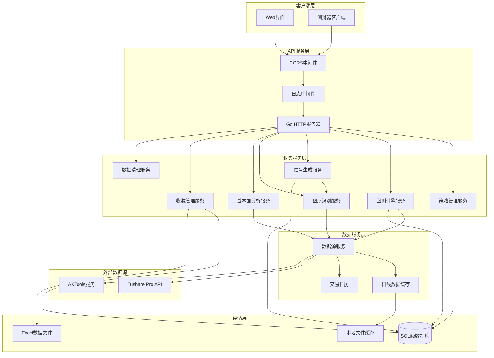

# 股票量化策略回测系统设计文档

## 📋 目录
- [系统概述](#系统概述)
- [核心架构](#核心架构)
- [模块设计](#模块设计)
- [数据模型](#数据模型)
- [API接口设计](#api接口设计)
- [性能优化](#性能优化)
- [部署架构](#部署架构)

---

## 🎯 系统概述

### 设计目标
构建一个高性能、可扩展的股票量化策略回测系统，支持多种策略类型、多时间周期回测，并提供详细的性能分析和风险评估。

### 核心特性
- ✅ **多策略支持**: 技术指标策略、机器学习策略、复合策略
- ✅ **高精度回测**: 精确到分钟级别的历史数据回测
- ✅ **实时监控**: 策略实时运行状态监控
- ✅ **风险管理**: 完整的风险控制和资金管理
- ✅ **性能分析**: 详细的回测报告和可视化分析
- ✅ **并发处理**: 支持多策略并行回测

### 技术栈
- **后端**: Go 1.24+ (net/http + ServeMux)
- **数据库**: SQLite (主库) + 内存缓存 (DailyCacheService)
- **数据源**: AKTools (AKShare) + Tushare Pro API
- **前端**: 原生JavaScript + ECharts + TailwindCSS
- **日志系统**: Zap结构化日志
- **文件处理**: Excelize (Excel文件处理)

---

## 🏗️ 核心架构

### 系统架构图



### 分层架构

#### 1. 表现层 (Presentation Layer)
- **Web前端**: 原生JavaScript + ECharts图表库
- **样式系统**: TailwindCSS + 自定义CSS
- **模块化架构**: ES6模块系统，按功能拆分

#### 2. 应用层 (Application Layer)  
- **HTTP服务器**: Go标准库net/http + ServeMux路由
- **中间件**: CORS处理、请求日志、错误处理
- **API处理器**: RESTful API端点处理

#### 3. 业务层 (Business Layer)
- **策略服务**: 内存存储的策略管理
- **回测引擎**: 多策略并行回测执行
- **信号服务**: 异步信号计算和存储
- **模式识别**: 技术指标和K线形态识别

#### 4. 数据层 (Data Layer)
- **SQLite数据库**: 轻量级本地数据存储
- **内存缓存**: DailyCacheService日线数据缓存
- **文件系统**: Excel文件和本地缓存文件

---

## 🔧 模块设计

### 1. 策略管理模块 (Strategy Management)

#### 功能职责
- 策略创建、编辑、删除
- 策略版本管理
- 策略参数配置
- 策略状态管理

#### 核心组件
```go
// 策略接口定义
type Strategy interface {
    Initialize(params map[string]interface{}) error
    OnBar(bar *MarketBar) (*Signal, error)
    OnTick(tick *MarketTick) (*Signal, error)
    GetMetrics() *StrategyMetrics
    Cleanup() error
}

// 策略管理器
type StrategyManager struct {
    strategies map[string]Strategy
    config     *StrategyConfig
    logger     *logger.Logger
}
```

### 2. 回测引擎模块 (Backtest Engine)

#### 功能职责
- 历史数据回放
- 策略信号执行
- 交易成本计算
- 滑点模拟
- 性能指标计算

#### 核心组件
```go
// 回测引擎
type BacktestEngine struct {
    dataProvider DataProvider
    broker       *SimulatedBroker
    portfolio    *Portfolio
    riskManager  *RiskManager
    metrics      *PerformanceMetrics
}

// 回测配置
type BacktestConfig struct {
    StartDate    time.Time
    EndDate      time.Time
    InitialCash  decimal.Decimal
    Commission   decimal.Decimal
    Slippage     decimal.Decimal
    Benchmark    string
}
```

### 3. 组合管理模块 (Portfolio Management)

#### 功能职责
- 持仓管理
- 资金管理
- 订单管理
- 盈亏计算

#### 核心组件
```go
// 投资组合
type Portfolio struct {
    cash        decimal.Decimal
    positions   map[string]*Position
    orders      []*Order
    trades      []*Trade
    metrics     *PortfolioMetrics
}

// 持仓信息
type Position struct {
    Symbol      string
    Quantity    int64
    AvgPrice    decimal.Decimal
    MarketValue decimal.Decimal
    UnrealizedPL decimal.Decimal
}
```

### 4. 风险管理模块 (Risk Management)

#### 功能职责
- 实时风险监控
- 止损止盈控制
- 仓位控制
- 最大回撤控制

#### 核心组件
```go
// 风险管理器
type RiskManager struct {
    maxDrawdown     decimal.Decimal
    maxPositionSize decimal.Decimal
    stopLossRatio   decimal.Decimal
    takeProfitRatio decimal.Decimal
}

// 风险检查
func (rm *RiskManager) CheckRisk(order *Order, portfolio *Portfolio) error {
    // 实现风险检查逻辑
}
```

### 5. 数据管理模块 (Data Management)

#### 功能职责
- 市场数据获取
- 历史数据存储
- 数据清洗和预处理
- 数据缓存管理

#### 核心组件
```go
// 数据提供者接口
type DataProvider interface {
    GetHistoricalData(symbol string, start, end time.Time) ([]*MarketBar, error)
    GetRealtimeData(symbol string) (*MarketTick, error)
    Subscribe(symbols []string, callback func(*MarketTick)) error
}

// 市场数据
type MarketBar struct {
    Symbol    string
    Timestamp time.Time
    Open      decimal.Decimal
    High      decimal.Decimal
    Low       decimal.Decimal
    Close     decimal.Decimal
    Volume    int64
}
```

---

## 📊 数据模型

### 1. 收藏和分组相关表

#### favorite_groups (收藏分组表)
```sql
CREATE TABLE IF NOT EXISTS favorite_groups (
    id TEXT PRIMARY KEY,
    name TEXT NOT NULL,
    color TEXT NOT NULL,
    sort_order INTEGER DEFAULT 0,
    created_at DATETIME NOT NULL,
    updated_at DATETIME NOT NULL
);
```

#### favorite_stocks (收藏股票表)
```sql
CREATE TABLE IF NOT EXISTS favorite_stocks (
    id TEXT PRIMARY KEY,
    ts_code TEXT NOT NULL,
    name TEXT NOT NULL,
    start_date TEXT,
    end_date TEXT,
    group_id TEXT NOT NULL,
    sort_order INTEGER DEFAULT 0,
    created_at DATETIME NOT NULL,
    updated_at DATETIME NOT NULL,
    FOREIGN KEY (group_id) REFERENCES favorite_groups(id)
);
```

### 2. 信号存储表

#### stock_signals (股票信号表)
```sql
CREATE TABLE IF NOT EXISTS stock_signals (
    id TEXT PRIMARY KEY,
    ts_code TEXT NOT NULL,
    name TEXT NOT NULL,
    trade_date TEXT NOT NULL,           -- 信号基于的交易日期
    signal_date TEXT NOT NULL,          -- 信号计算日期
    signal_type TEXT NOT NULL,          -- 信号类型: BUY, SELL, HOLD
    signal_strength TEXT NOT NULL,      -- 信号强度: STRONG, MEDIUM, WEAK
    confidence REAL NOT NULL,           -- 置信度 0-1
    patterns TEXT,                      -- 识别到的图形模式(JSON格式)
    technical_indicators TEXT,          -- 技术指标数据(JSON格式)
    predictions TEXT,                   -- 预测数据(JSON格式)
    description TEXT,                   -- 信号描述
    created_at DATETIME NOT NULL,
    updated_at DATETIME NOT NULL,
    UNIQUE(ts_code, trade_date)         -- 每个股票每天只有一个信号记录
);
```

### 3. 内存数据模型

#### 策略模型 (Strategy)
```go
type Strategy struct {
    ID          string                 `json:"id"`
    Name        string                 `json:"name"`
    Description string                 `json:"description"`
    Type        StrategyType           `json:"strategy_type"`
    Status      StrategyStatus         `json:"status"`
    Parameters  map[string]interface{} `json:"parameters"`
    Code        string                 `json:"code,omitempty"`
    CreatedBy   string                 `json:"created_by"`
    CreatedAt   time.Time              `json:"created_at"`
    UpdatedAt   time.Time              `json:"updated_at"`
}
```

#### 回测模型 (Backtest)
```go
type Backtest struct {
    ID            string         `json:"id"`
    Name          string         `json:"name"`
    StrategyID    string         `json:"strategy_id,omitempty"`    // 兼容单策略
    StrategyIDs   []string       `json:"strategy_ids"`             // 多策略ID列表
    StrategyNames []string       `json:"strategy_names,omitempty"` // 策略名称列表
    Symbols       []string       `json:"symbols"`
    StartDate     time.Time      `json:"start_date"`
    EndDate       time.Time      `json:"end_date"`
    InitialCash   float64        `json:"initial_cash"`
    Commission    float64        `json:"commission"`
    Slippage      float64        `json:"slippage"`
    Benchmark     string         `json:"benchmark"`
    Status        BacktestStatus `json:"status"`
    Progress      int            `json:"progress"`
    ErrorMessage  string         `json:"error_message,omitempty"`
    CreatedBy     string         `json:"created_by"`
    CreatedAt     time.Time      `json:"created_at"`
    StartedAt     *time.Time     `json:"started_at,omitempty"`
    CompletedAt   *time.Time     `json:"completed_at,omitempty"`
}
```

### 4. 缓存数据模型

#### 日线数据缓存 (DailyCacheService)
```go
type CacheEntry struct {
    Data      []models.StockDaily `json:"data"`       // 缓存的日线数据
    ExpiresAt time.Time           `json:"expires_at"` // 过期时间
    CreatedAt time.Time           `json:"created_at"` // 创建时间
}

type CacheStats struct {
    Hits        int64     `json:"hits"`         // 命中次数
    Misses      int64     `json:"misses"`       // 未命中次数
    Entries     int64     `json:"entries"`      // 缓存条目数
    Evictions   int64     `json:"evictions"`    // 清理次数
    LastCleanup time.Time `json:"last_cleanup"` // 上次清理时间
}
```

---

## 🔌 API接口设计

### 1. 策略管理API

#### 获取策略列表
```http
GET /api/v1/strategies?page=1&size=20&status=active&type=technical&keyword=MACD
```

**响应**:
```json
{
  "success": true,
  "message": "获取策略列表成功",
  "data": {
    "total": 8,
    "page": 1,
    "size": 20,
    "items": [
      {
        "id": "macd_golden_cross",
        "name": "MACD金叉策略",
        "description": "当MACD线上穿信号线时买入，下穿时卖出",
        "strategy_type": "technical",
        "status": "active",
        "parameters": {
          "fast_period": 12,
          "slow_period": 26,
          "signal_period": 9
        },
        "created_at": "2024-01-15T10:30:00Z",
        "updated_at": "2024-01-15T10:30:00Z"
      }
    ]
  }
}
```

#### 创建策略
```http
POST /api/v1/strategies
Content-Type: application/json

{
  "name": "RSI超买超卖策略",
  "description": "基于RSI指标的超买超卖策略",
  "type": "technical",
  "code": "// 策略实现代码",
  "parameters": {
    "rsi_period": 14,
    "overbought_threshold": 70,
    "oversold_threshold": 30
  }
}
```

**响应**:
```json
{
  "success": true,
  "message": "策略创建成功",
  "data": {
    "id": "rsi_overbought_oversold",
    "name": "RSI超买超卖策略",
    "description": "基于RSI指标的超买超卖策略",
    "strategy_type": "technical",
    "status": "inactive",
    "created_at": "2024-01-15T11:00:00Z"
  }
}
```

### 2. 回测管理API

#### 获取回测列表
```http
GET /api/v1/backtests?page=1&size=20&status=completed&strategy_id=macd_golden_cross
```

**响应**:
```json
{
  "success": true,
  "message": "获取回测列表成功",
  "data": {
    "total": 15,
    "page": 1,
    "size": 20,
    "items": [
      {
        "id": "bt_20240115_001",
        "name": "多策略回测-2023年",
        "strategy_ids": ["macd_golden_cross", "rsi_overbought_oversold"],
        "strategy_names": ["MACD金叉策略", "RSI超买超卖策略"],
        "symbols": ["000001.SZ", "000002.SZ", "600000.SH"],
        "start_date": "2023-01-01T00:00:00Z",
        "end_date": "2023-12-31T00:00:00Z",
        "initial_cash": 1000000,
        "commission": 0.0003,
        "slippage": 0.0001,
        "benchmark": "HS300",
        "status": "completed",
        "progress": 100,
        "created_at": "2024-01-15T10:00:00Z",
        "started_at": "2024-01-15T10:01:00Z",
        "completed_at": "2024-01-15T10:15:00Z"
      }
    ]
  }
}
```

#### 创建并启动回测任务
```http
POST /api/v1/backtests
Content-Type: application/json

{
  "name": "多策略组合回测-2024年",
  "strategy_ids": ["macd_golden_cross", "rsi_overbought_oversold"],
  "symbols": ["000001.SZ", "000002.SZ", "600000.SH"],
  "start_date": "2024-01-01",
  "end_date": "2024-12-31",
  "initial_cash": 1000000,
  "commission": 0.0003,
  "slippage": 0.0001,
  "benchmark": "HS300"
}
```

**响应**:
```json
{
  "success": true,
  "message": "回测创建并启动成功",
  "data": {
    "id": "bt_20240115_002",
    "name": "多策略组合回测-2024年",
    "strategy_ids": ["macd_golden_cross", "rsi_overbought_oversold"],
    "strategy_names": ["MACD金叉策略", "RSI超买超卖策略"],
    "status": "running",
    "progress": 0,
    "created_at": "2024-01-15T11:00:00Z",
    "started_at": "2024-01-15T11:00:00Z"
  }
}
```

#### 获取回测进度
```http
GET /api/v1/backtests/{id}/progress
```

**响应**:
```json
{
  "success": true,
  "message": "获取回测进度成功",
  "data": {
    "backtest_id": "bt_20240115_002",
    "status": "running",
    "progress": 65,
    "message": "正在处理 2024-08-15 的数据",
    "current_date": "2024-08-15",
    "estimated_completion": "2024-01-15T11:15:00Z"
  }
}
```

#### 获取回测结果
```http
GET /api/v1/backtests/{id}/results
```

**响应**:
```json
{
  "success": true,
  "message": "获取回测结果成功",
  "data": {
    "backtest_id": "bt_20240115_001",
    "backtest_name": "多策略回测-2023年",
    "strategy_results": [
      {
        "strategy_id": "macd_golden_cross",
        "strategy_name": "MACD金叉策略",
        "total_return": 0.2856,
        "annual_return": 0.2856,
        "max_drawdown": -0.1234,
        "sharpe_ratio": 1.45,
        "win_rate": 0.6234,
        "total_trades": 156
      }
    ],
    "portfolio_performance": {
      "total_return": 0.3124,
      "annual_return": 0.3124,
      "max_drawdown": -0.0987,
      "sharpe_ratio": 1.67,
      "sortino_ratio": 2.14,
      "win_rate": 0.6785,
      "total_trades": 312
    },
    "equity_curve": [
      {
        "date": "2023-01-01",
        "portfolio_value": 1000000,
        "cash": 1000000,
        "holdings": 0
      }
    ],
    "trades": [
      {
        "id": "trade_001",
        "strategy_id": "macd_golden_cross",
        "symbol": "000001.SZ",
        "side": "buy",
        "quantity": 1000,
        "price": 12.34,
        "timestamp": "2023-01-15T09:30:00Z"
      }
    ]
  }
}
```

### 3. 股票数据API

#### 获取股票基本信息
```http
GET /api/v1/stocks/{code}/basic
```

#### 获取股票日线数据
```http
GET /api/v1/stocks/{code}/daily?start_date=20240101&end_date=20241231&adjust=qfq
```

#### 获取技术指标
```http
GET /api/v1/stocks/{code}/indicators
```

#### 获取买卖预测
```http
GET /api/v1/stocks/{code}/predictions
```

### 4. 信号计算API

#### 计算单个股票信号
```http
POST /api/v1/signals/calculate
Content-Type: application/json

{
  "ts_code": "000001.SZ",
  "trade_date": "20240115"
}
```

#### 批量计算信号
```http
POST /api/v1/signals/batch
Content-Type: application/json

{
  "symbols": ["000001.SZ", "000002.SZ"],
  "trade_date": "20240115"
}
```

#### 获取最新信号
```http
GET /api/v1/signals?limit=20
```

### 5. 收藏管理API

#### 获取收藏列表
```http
GET /api/v1/favorites
```

#### 添加收藏
```http
POST /api/v1/favorites
Content-Type: application/json

{
  "ts_code": "000001.SZ",
  "name": "平安银行",
  "group_id": "group_001"
}
```

#### 获取收藏股票信号
```http
GET /api/v1/favorites/signals
```

---

## ⚡ 性能优化

### 1. 数据库优化

#### SQLite索引策略
```sql
-- 收藏股票查询优化
CREATE INDEX IF NOT EXISTS idx_favorite_stocks_ts_code ON favorite_stocks(ts_code);
CREATE INDEX IF NOT EXISTS idx_favorite_stocks_group_id ON favorite_stocks(group_id);
CREATE INDEX IF NOT EXISTS idx_favorite_stocks_sort_order ON favorite_stocks(group_id, sort_order);

-- 股票信号查询优化
CREATE INDEX IF NOT EXISTS idx_stock_signals_ts_code ON stock_signals(ts_code);
CREATE INDEX IF NOT EXISTS idx_stock_signals_trade_date ON stock_signals(trade_date);
CREATE INDEX IF NOT EXISTS idx_stock_signals_signal_date ON stock_signals(signal_date);
CREATE INDEX IF NOT EXISTS idx_stock_signals_signal_type ON stock_signals(signal_type);
CREATE INDEX IF NOT EXISTS idx_stock_signals_ts_code_trade_date ON stock_signals(ts_code, trade_date);
```

### 2. 缓存策略

#### DailyCacheService内存缓存设计
```go
// 日线数据缓存服务
type DailyCacheService struct {
    cache         sync.Map      // 并发安全的缓存存储
    defaultTTL    time.Duration // 默认过期时间
    maxCacheAge   time.Duration // 最大缓存时间
    cleanupTicker *time.Ticker  // 清理定时器
    stats         CacheStats    // 缓存统计
}

// 缓存键生成
func (s *DailyCacheService) generateKey(symbol, startDate, endDate string) string {
    return fmt.Sprintf("%s:%s:%s", symbol, startDate, endDate)
}

// 获取缓存数据
func (s *DailyCacheService) Get(symbol, startDate, endDate string) ([]models.StockDaily, bool) {
    key := s.generateKey(symbol, startDate, endDate)
    if value, ok := s.cache.Load(key); ok {
        if entry, ok := value.(*CacheEntry); ok && !entry.IsExpired() {
            s.incrementHits()
            return entry.Data, true
        }
    }
    s.incrementMisses()
    return nil, false
}
```

### 3. 并发处理

#### 多策略并行回测
```go
// 并行执行多个策略的回测
func (s *BacktestService) runMultiStrategyBacktestTask(ctx context.Context, backtest *models.Backtest, strategies []*models.Strategy) {
    // 预加载所有股票的历史数据
    if err := s.preloadBacktestData(ctx, backtest.Symbols, backtest.StartDate, backtest.EndDate); err != nil {
        s.logger.Error("预加载数据失败", logger.ErrorField(err))
        return
    }

    // 为每个策略分配独立的goroutine
    var wg sync.WaitGroup
    semaphore := make(chan struct{}, runtime.NumCPU())
    
    for _, strategy := range strategies {
        wg.Add(1)
        go func(strat *models.Strategy) {
            defer wg.Done()
            semaphore <- struct{}{}
            defer func() { <-semaphore }()
            
            s.runSingleStrategyBacktest(ctx, backtest, strat)
        }(strategy)
    }
    
    wg.Wait()
}
```

#### 异步信号计算
```go
// SignalService异步处理信号计算
func (s *SignalService) Start() {
    go s.processSignalQueue()
}

func (s *SignalService) processSignalQueue() {
    for {
        select {
        case task := <-s.taskQueue:
            s.processSignalTask(task)
        case <-s.stopChan:
            return
        }
    }
}
```

### 4. 内存优化

#### 数据预加载和缓存
```go
// 预加载回测数据，提高回测性能
func (s *BacktestService) preloadBacktestData(ctx context.Context, symbols []string, startDate, endDate time.Time) error {
    for _, symbol := range symbols {
        // 检查缓存中是否已有数据
        if s.dailyCacheService != nil {
            if _, found := s.dailyCacheService.Get(symbol, startDateStr, endDateStr); found {
                continue
            }
        }

        // 从API获取数据并存入缓存
        data, err := client.GetDailyData(symbol, startDateStr, endDateStr, "qfq")
        if err != nil {
            continue
        }
        
        if s.dailyCacheService != nil && len(data) > 0 {
            s.dailyCacheService.Set(symbol, startDateStr, endDateStr, data)
        }
    }
    return nil
}
```

---

## 🚀 部署架构

### 1. 容器化部署

#### Dockerfile
```dockerfile
FROM golang:1.24-alpine AS builder

WORKDIR /app
COPY go.mod go.sum ./
RUN go mod download

COPY . .
RUN CGO_ENABLED=1 GOOS=linux go build -o stock-a-future ./cmd/server

FROM alpine:latest
RUN apk --no-cache add ca-certificates sqlite
WORKDIR /root/

COPY --from=builder /app/stock-a-future .
COPY --from=builder /app/web ./web
COPY --from=builder /app/data ./data
COPY --from=builder /app/sql ./sql

EXPOSE 8080

CMD ["./stock-a-future"]
```

#### Docker Compose
```yaml
version: '3.8'

services:
  stock-a-future:
    build: .
    ports:
      - "8080:8080"
    environment:
      - SERVER_HOST=0.0.0.0
      - SERVER_PORT=8080
      - DATA_SOURCE_TYPE=aktools
      - AKTOOLS_BASE_URL=http://aktools:8080
      - LOG_LEVEL=info
      - CACHE_ENABLED=true
    volumes:
      - ./data:/root/data
      - ./logs:/root/logs
    depends_on:
      - aktools

  aktools:
    image: aktools/aktools:latest
    ports:
      - "8081:8080"
    volumes:
      - aktools_data:/app/data
      - aktools_logs:/app/logs

volumes:
  aktools_data:
  aktools_logs:
```

### 2. 本地开发部署

#### 快速启动脚本
```bash
#!/bin/bash
# quick-start.sh

# 启动AKTools服务
echo "启动AKTools服务..."
cd venv && ./start_aktools.sh

# 等待AKTools服务启动
sleep 10

# 启动Stock-A-Future服务
echo "启动Stock-A-Future服务..."
go run cmd/server/main.go

echo "服务启动完成！"
echo "访问 http://localhost:8080 查看Web界面"
```

#### 配置文件示例
```env
# .env
SERVER_HOST=localhost
SERVER_PORT=8080
DATA_SOURCE_TYPE=aktools
AKTOOLS_BASE_URL=http://127.0.0.1:8080
TUSHARE_TOKEN=your_tushare_token_here
LOG_LEVEL=info
LOG_FORMAT=console
CACHE_ENABLED=true
CACHE_DEFAULT_TTL=1h
CLEANUP_ENABLED=true
CLEANUP_INTERVAL=24h
CLEANUP_RETENTION_DAYS=30
```

### 3. 监控和日志

#### Zap结构化日志
```go
// 日志配置
type Config struct {
    Level         string
    Format        string        // "json" or "console"
    Output        string        // "stdout", "stderr", or file path
    Filename      string
    MaxSize       int          // MB
    MaxBackups    int
    MaxAge        int          // days
    Compress      bool
    ConsoleFormat bool
    ShowCaller    bool
    ShowTime      bool
}

// 使用结构化日志记录
logger.Info("回测任务开始",
    logger.String("backtest_id", backtestID),
    logger.Any("strategy_ids", strategyIDs),
    logger.String("start_date", startDate.Format("2006-01-02")),
    logger.String("end_date", endDate.Format("2006-01-02")),
)
```

#### 缓存统计监控
```go
// 缓存统计
type CacheStats struct {
    Hits        int64     `json:"hits"`         // 命中次数
    Misses      int64     `json:"misses"`       // 未命中次数
    Entries     int64     `json:"entries"`      // 缓存条目数
    Evictions   int64     `json:"evictions"`    // 清理次数
    LastCleanup time.Time `json:"last_cleanup"` // 上次清理时间
}

// 缓存统计API
GET /api/v1/cache/stats
```

---

## 📈 扩展性考虑

### 1. 数据源扩展
- **多数据源支持**: 当前支持Tushare和AKTools，可轻松扩展其他数据源
- **数据源工厂模式**: 统一的数据源接口，便于添加新的数据提供商
- **数据源切换**: 运行时动态切换数据源，提高系统可靠性

### 2. 策略扩展
- **策略插件化**: 支持动态加载策略模块
- **多策略类型**: 技术指标、基本面、机器学习、复合策略
- **策略参数化**: 灵活的参数配置系统

### 3. 存储扩展
- **数据库升级**: 从SQLite升级到PostgreSQL或MySQL
- **分布式存储**: 支持数据分片和读写分离
- **时序数据库**: 集成InfluxDB处理高频数据

### 4. 计算扩展
- **分布式回测**: 支持多节点并行回测
- **GPU加速**: 集成CUDA加速复杂计算
- **云计算**: 支持AWS/阿里云等云平台部署

---

## 🔒 安全性设计

### 1. API安全
- **CORS配置**: 跨域请求安全控制
- **参数验证**: 严格的输入参数验证和清理
- **错误处理**: 统一的错误响应格式，避免信息泄露

### 2. 数据安全
- **本地存储**: 数据存储在本地，避免网络传输风险
- **Token保护**: Tushare Token等敏感信息脱敏处理
- **日志安全**: 日志中不记录敏感信息

### 3. 系统安全
- **输入验证**: 所有API输入进行严格验证
- **SQL注入防护**: 使用参数化查询和ORM
- **文件访问控制**: 限制文件系统访问范围
- **优雅关闭**: 支持信号处理和资源清理

---

## 📝 总结

本设计文档基于Stock-A-Future项目的实际代码实现，提供了一个完整的股票量化策略回测系统架构，具备以下特点：

### 🎯 核心优势

1. **轻量级架构**: 基于Go标准库和SQLite，部署简单，维护成本低
2. **多策略支持**: 支持单策略和多策略并行回测，策略类型丰富
3. **高性能缓存**: DailyCacheService提供高效的内存缓存机制
4. **多数据源**: 支持Tushare和AKTools双数据源，提高数据可靠性
5. **实时信号**: 异步信号计算和存储，支持实时买卖点预测
6. **现代前端**: 原生JavaScript + ECharts，响应式设计，用户体验优秀

### 🔧 技术特色

- **Go 1.24+**: 使用最新Go版本和标准库HTTP服务器
- **SQLite数据库**: 轻量级本地存储，无需额外数据库服务
- **结构化日志**: Zap日志系统，支持多种输出格式
- **并发优化**: 多goroutine并行处理，充分利用多核性能
- **优雅关闭**: 完整的资源清理和服务关闭机制

### 📈 应用场景

该系统适合以下用户和场景：

1. **个人投资者**: 简单部署，快速上手，支持常用技术指标策略
2. **量化团队**: 支持多策略组合，详细回测报告和性能分析
3. **研究机构**: 灵活的策略框架，支持自定义策略开发
4. **教育培训**: 完整的系统设计，适合量化交易教学

### 🚀 未来发展

系统具备良好的扩展性，可以逐步升级：

- 集成机器学习算法
- 支持更多数据源和市场
- 升级到分布式架构
- 添加实盘交易接口

该系统为量化交易提供了一个坚实的基础平台，既满足当前需求，又为未来扩展预留了充分的空间。
