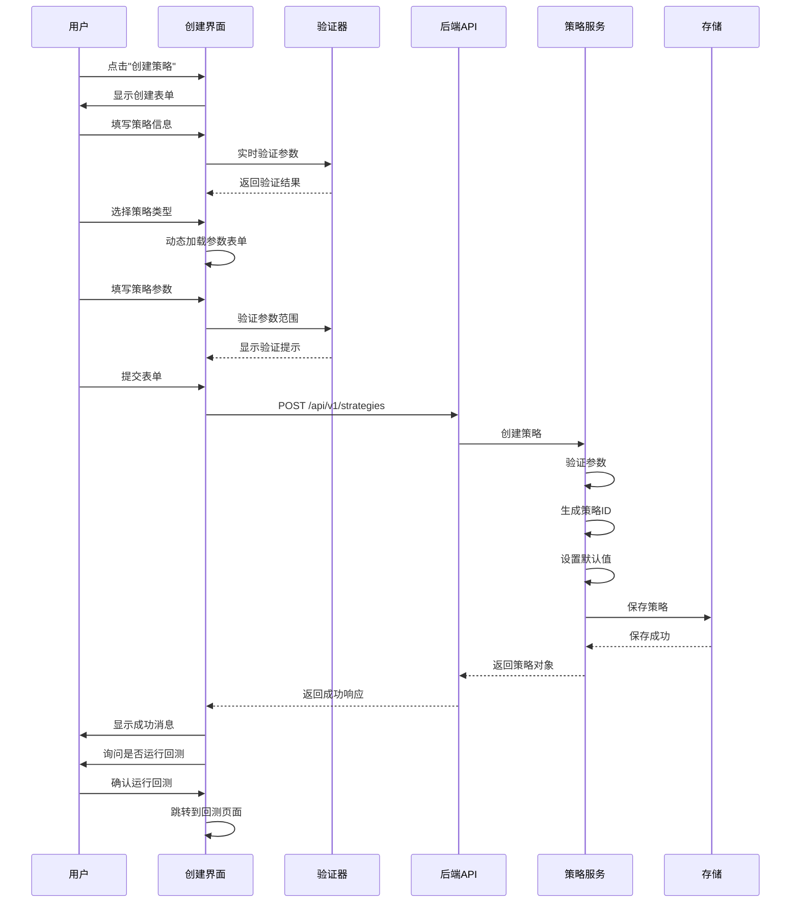

# 回测策略创建功能设计方案

## 📋 目录
- [功能概述](#功能概述)
- [需求分析](#需求分析)
- [系统设计](#系统设计)
- [UI设计](#ui设计)
- [参数优化功能](#参数优化功能)
- [API设计](#api设计)
- [数据模型](#数据模型)
- [实现方案](#实现方案)
- [技术细节](#技术细节)
- [测试方案](#测试方案)

---

## 🎯 功能概述

### 设计目标
实现一个用户友好的回测策略创建界面,支持用户通过可视化表单配置和创建自定义量化交易策略,并能够立即进行回测验证。

### 核心特性
- ✅ **可视化策略创建**: 通过表单配置策略参数,无需编写代码
- ✅ **多策略类型支持**: 技术指标、基本面、机器学习、复合策略
- ✅ **参数验证**: 实时参数验证和错误提示
- ✅ **策略模板**: 提供预设策略模板,快速上手
- ✅ **即时预览**: 策略参数即时预览效果
- ✅ **一键回测**: 创建完成后可直接运行回测
- 🔧 **参数优化**: 智能参数优化和自动参数挖掘(未来扩展)

---

## 📊 需求分析

### 功能需求

#### 1. 策略基本信息配置
- 策略名称(必填,最长100字符)
- 策略描述(可选,最长1000字符)
- 策略类型(必选):
  - 技术指标策略
  - 基本面策略
  - 机器学习策略
  - 复合策略

#### 2. 策略参数配置
根据不同策略类型,提供对应的参数配置项:

##### MACD策略参数
- 快线周期 (fast_period): 1-50,默认12
- 慢线周期 (slow_period): 1-100,默认26
- 信号线周期 (signal_period): 1-50,默认9
- 买入阈值 (buy_threshold): -1到1,默认0
- 卖出阈值 (sell_threshold): -1到1,默认0

##### 双均线策略参数
- 短期均线周期 (short_period): 1-50,默认5
- 长期均线周期 (long_period): 1-200,默认20
- 均线类型 (ma_type): SMA/EMA/WMA,默认SMA
- 突破阈值 (threshold): 0-0.1,默认0.01

##### RSI策略参数
- RSI周期 (period): 1-50,默认14
- 超买阈值 (overbought): 50-100,默认70
- 超卖阈值 (oversold): 0-50,默认30

##### 布林带策略参数
- 周期 (period): 1-50,默认20
- 标准差倍数 (std_dev): 0.5-5,默认2

#### 3. 高级配置(可选)
- 策略代码编辑器(未来扩展)
- 风险控制参数:
  - 止损比例
  - 止盈比例
  - 最大持仓比例
- 交易时间限制

#### 4. 策略模板
提供常用策略模板供用户快速创建:
- MACD金叉策略
- 双均线突破策略
- RSI超买超卖策略
- 布林带均值回归策略
- 多因子复合策略

### 非功能需求

#### 1. 性能要求
- 表单提交响应时间 < 500ms
- 参数验证实时响应 < 100ms
- 支持并发创建策略

#### 2. 可用性要求
- 表单设计简洁直观
- 提供参数说明和示例
- 实时错误提示和修正建议
- 支持表单数据草稿保存

#### 3. 扩展性要求
- 支持动态添加新策略类型
- 参数配置可灵活扩展
- 策略代码可插件化

---

## 🏗️ 系统设计

### 整体架构

```mermaid
graph TB
    subgraph "前端层"
        UI[策略创建UI]
        FORM[动态表单组件]
        VALIDATOR[参数验证器]
        PREVIEW[策略预览]
    end
    
    subgraph "API层"
        API[策略API接口]
        VALIDATOR_API[参数验证API]
    end
    
    subgraph "业务层"
        STRATEGY_SERVICE[策略服务]
        PARAM_VALIDATOR[参数验证服务]
        TEMPLATE_SERVICE[模板服务]
    end
    
    subgraph "存储层"
        MEMORY_STORE[内存存储]
        DB[数据库(未来)]
    end
    
    UI --> FORM
    FORM --> VALIDATOR
    VALIDATOR --> API
    API --> STRATEGY_SERVICE
    STRATEGY_SERVICE --> PARAM_VALIDATOR
    STRATEGY_SERVICE --> TEMPLATE_SERVICE
    STRATEGY_SERVICE --> MEMORY_STORE
    
    PREVIEW --> API
```

### 核心流程

#### 策略创建流程



---

## 🎨 UI设计

### 页面布局

#### 1. 策略列表页面增强
在现有 `StrategiesPage.tsx` 中增强"创建策略"按钮功能:

```tsx
// 当前状态(599行)
<Button
  variant="contained"
  startIcon={<AddIcon />}
  onClick={() => {
    // TODO: 打开创建策略对话框
    console.log('创建新策略');
  }}
>
  创建策略
</Button>

// 改进后
<Button
  variant="contained"
  startIcon={<AddIcon />}
  onClick={() => setCreateDialogOpen(true)}
>
  创建策略
</Button>
```

#### 2. 策略创建对话框设计

##### 对话框结构
```tsx
<Dialog
  open={createDialogOpen}
  onClose={handleCreateClose}
  maxWidth="md"
  fullWidth
>
  <DialogTitle>
    <Box sx={{ display: 'flex', justifyContent: 'space-between', alignItems: 'center' }}>
      <Typography variant="h6">创建新策略</Typography>
      <IconButton onClick={handleCreateClose}>
        <CloseIcon />
      </IconButton>
    </Box>
  </DialogTitle>
  
  <DialogContent dividers>
    {/* 步骤1: 基本信息 */}
    {activeStep === 0 && renderBasicInfoForm()}
    
    {/* 步骤2: 策略类型和参数 */}
    {activeStep === 1 && renderStrategyParametersForm()}
    
    {/* 步骤3: 高级设置(可选) */}
    {activeStep === 2 && renderAdvancedSettingsForm()}
    
    {/* 步骤4: 确认和预览 */}
    {activeStep === 3 && renderStrategyPreview()}
  </DialogContent>
  
  <DialogActions>
    {/* 步骤导航按钮 */}
    <Stepper activeStep={activeStep} />
    <Button onClick={handleBack}>上一步</Button>
    <Button onClick={handleNext}>下一步</Button>
    <Button onClick={handleCreateSubmit} variant="contained">创建</Button>
  </DialogActions>
</Dialog>
```

##### 基本信息表单(步骤1)
```tsx
const renderBasicInfoForm = () => (
  <Box sx={{ display: 'flex', flexDirection: 'column', gap: 3, py: 2 }}>
    {/* 策略名称 */}
    <TextField
      label="策略名称"
      placeholder="例如: 我的MACD策略"
      value={formData.name}
      onChange={(e) => setFormData({ ...formData, name: e.target.value })}
      fullWidth
      required
      error={!!errors.name}
      helperText={errors.name || '策略的唯一标识名称,最多100个字符'}
    />

    {/* 策略描述 */}
    <TextField
      label="策略描述"
      placeholder="简要描述策略的交易逻辑和适用场景"
      value={formData.description}
      onChange={(e) => setFormData({ ...formData, description: e.target.value })}
      fullWidth
      multiline
      rows={4}
      error={!!errors.description}
      helperText={errors.description || '详细描述策略的目标和特点,最多1000个字符'}
    />

    {/* 策略模板(可选) */}
    <FormControl fullWidth>
      <InputLabel>使用模板(可选)</InputLabel>
      <Select
        value={selectedTemplate}
        onChange={handleTemplateSelect}
        label="使用模板(可选)"
      >
        <MenuItem value="">不使用模板</MenuItem>
        <MenuItem value="macd_golden_cross">MACD金叉策略</MenuItem>
        <MenuItem value="ma_crossover">双均线策略</MenuItem>
        <MenuItem value="rsi_strategy">RSI超买超卖</MenuItem>
        <MenuItem value="bollinger_strategy">布林带策略</MenuItem>
      </Select>
    </FormControl>
  </Box>
);
```

##### 策略参数表单(步骤2)
```tsx
const renderStrategyParametersForm = () => (
  <Box sx={{ display: 'flex', flexDirection: 'column', gap: 3, py: 2 }}>
    {/* 策略类型选择 */}
    <FormControl fullWidth required>
      <InputLabel>策略类型</InputLabel>
      <Select
        value={formData.strategy_type}
        onChange={handleStrategyTypeChange}
        label="策略类型"
      >
        <MenuItem value="technical">技术指标策略</MenuItem>
        <MenuItem value="fundamental">基本面策略</MenuItem>
        <MenuItem value="ml">机器学习策略</MenuItem>
        <MenuItem value="composite">复合策略</MenuItem>
      </Select>
    </FormControl>

    {/* 根据策略类型动态渲染参数表单 */}
    {renderParameterFields()}
  </Box>
);

// 动态参数表单渲染
const renderParameterFields = () => {
  const { strategy_type } = formData;

  // MACD策略参数
  if (strategy_type === 'technical' && formData.strategy_id === 'macd') {
    return (
      <>
        <TextField
          label="快线周期"
          type="number"
          value={formData.parameters.fast_period || 12}
          onChange={(e) => handleParameterChange('fast_period', parseInt(e.target.value))}
          inputProps={{ min: 1, max: 50 }}
          fullWidth
          helperText="MACD快线的计算周期,通常为12天"
        />
        <TextField
          label="慢线周期"
          type="number"
          value={formData.parameters.slow_period || 26}
          onChange={(e) => handleParameterChange('slow_period', parseInt(e.target.value))}
          inputProps={{ min: 1, max: 100 }}
          fullWidth
          helperText="MACD慢线的计算周期,通常为26天"
        />
        <TextField
          label="信号线周期"
          type="number"
          value={formData.parameters.signal_period || 9}
          onChange={(e) => handleParameterChange('signal_period', parseInt(e.target.value))}
          inputProps={{ min: 1, max: 50 }}
          fullWidth
          helperText="信号线的计算周期,通常为9天"
        />
        <TextField
          label="买入阈值"
          type="number"
          value={formData.parameters.buy_threshold || 0}
          onChange={(e) => handleParameterChange('buy_threshold', parseFloat(e.target.value))}
          inputProps={{ min: -1, max: 1, step: 0.1 }}
          fullWidth
          helperText="MACD线超过此阈值时产生买入信号,默认为0"
        />
        <TextField
          label="卖出阈值"
          type="number"
          value={formData.parameters.sell_threshold || 0}
          onChange={(e) => handleParameterChange('sell_threshold', parseFloat(e.target.value))}
          inputProps={{ min: -1, max: 1, step: 0.1 }}
          fullWidth
          helperText="MACD线低于此阈值时产生卖出信号,默认为0"
        />
      </>
    );
  }

  // 双均线策略参数
  if (strategy_type === 'technical' && formData.strategy_id === 'ma_crossover') {
    return (
      <>
        <TextField
          label="短期均线周期"
          type="number"
          value={formData.parameters.short_period || 5}
          onChange={(e) => handleParameterChange('short_period', parseInt(e.target.value))}
          inputProps={{ min: 1, max: 50 }}
          fullWidth
          helperText="短期移动平均线的计算周期,通常为5天"
        />
        <TextField
          label="长期均线周期"
          type="number"
          value={formData.parameters.long_period || 20}
          onChange={(e) => handleParameterChange('long_period', parseInt(e.target.value))}
          inputProps={{ min: 1, max: 200 }}
          fullWidth
          helperText="长期移动平均线的计算周期,通常为20天"
        />
        <FormControl fullWidth>
          <InputLabel>均线类型</InputLabel>
          <Select
            value={formData.parameters.ma_type || 'sma'}
            onChange={(e) => handleParameterChange('ma_type', e.target.value)}
            label="均线类型"
          >
            <MenuItem value="sma">简单移动平均(SMA)</MenuItem>
            <MenuItem value="ema">指数移动平均(EMA)</MenuItem>
            <MenuItem value="wma">加权移动平均(WMA)</MenuItem>
          </Select>
        </FormControl>
        <TextField
          label="突破阈值"
          type="number"
          value={formData.parameters.threshold || 0.01}
          onChange={(e) => handleParameterChange('threshold', parseFloat(e.target.value))}
          inputProps={{ min: 0, max: 0.1, step: 0.001 }}
          fullWidth
          helperText="均线突破的确认阈值,默认1%"
        />
      </>
    );
  }

  // RSI策略参数
  if (strategy_type === 'technical' && formData.strategy_id === 'rsi') {
    return (
      <>
        <TextField
          label="RSI周期"
          type="number"
          value={formData.parameters.period || 14}
          onChange={(e) => handleParameterChange('period', parseInt(e.target.value))}
          inputProps={{ min: 1, max: 50 }}
          fullWidth
          helperText="RSI指标的计算周期,通常为14天"
        />
        <TextField
          label="超买阈值"
          type="number"
          value={formData.parameters.overbought || 70}
          onChange={(e) => handleParameterChange('overbought', parseFloat(e.target.value))}
          inputProps={{ min: 50, max: 100 }}
          fullWidth
          helperText="RSI超过此值时认为超买,产生卖出信号,通常为70"
        />
        <TextField
          label="超卖阈值"
          type="number"
          value={formData.parameters.oversold || 30}
          onChange={(e) => handleParameterChange('oversold', parseFloat(e.target.value))}
          inputProps={{ min: 0, max: 50 }}
          fullWidth
          helperText="RSI低于此值时认为超卖,产生买入信号,通常为30"
        />
      </>
    );
  }

  // 布林带策略参数
  if (strategy_type === 'technical' && formData.strategy_id === 'bollinger') {
    return (
      <>
        <TextField
          label="周期"
          type="number"
          value={formData.parameters.period || 20}
          onChange={(e) => handleParameterChange('period', parseInt(e.target.value))}
          inputProps={{ min: 1, max: 50 }}
          fullWidth
          helperText="布林带的计算周期,通常为20天"
        />
        <TextField
          label="标准差倍数"
          type="number"
          value={formData.parameters.std_dev || 2}
          onChange={(e) => handleParameterChange('std_dev', parseFloat(e.target.value))}
          inputProps={{ min: 0.5, max: 5, step: 0.1 }}
          fullWidth
          helperText="布林带宽度的标准差倍数,通常为2倍"
        />
      </>
    );
  }

  return (
    <Alert severity="info">
      请先选择策略类型和具体策略
    </Alert>
  );
};
```

##### 策略预览(步骤4)
```tsx
const renderStrategyPreview = () => (
  <Box sx={{ py: 2 }}>
    <Typography variant="h6" gutterBottom>
      策略预览
    </Typography>
    
    <Paper sx={{ p: 3, mb: 2 }}>
      <Typography variant="subtitle1" gutterBottom fontWeight="bold">
        基本信息
      </Typography>
      <Box sx={{ display: 'grid', gridTemplateColumns: 'repeat(2, 1fr)', gap: 2 }}>
        <Box>
          <Typography variant="body2" color="text.secondary">策略名称</Typography>
          <Typography variant="body1">{formData.name}</Typography>
        </Box>
        <Box>
          <Typography variant="body2" color="text.secondary">策略类型</Typography>
          <Typography variant="body1">{STRATEGY_TYPES[formData.strategy_type]}</Typography>
        </Box>
        <Box sx={{ gridColumn: '1 / -1' }}>
          <Typography variant="body2" color="text.secondary">策略描述</Typography>
          <Typography variant="body1">{formData.description || '无'}</Typography>
        </Box>
      </Box>
    </Paper>

    <Paper sx={{ p: 3 }}>
      <Typography variant="subtitle1" gutterBottom fontWeight="bold">
        策略参数
      </Typography>
      <Box sx={{ display: 'grid', gridTemplateColumns: 'repeat(2, 1fr)', gap: 2 }}>
        {Object.entries(formData.parameters).map(([key, value]) => (
          <Box key={key}>
            <Typography variant="body2" color="text.secondary">{key}</Typography>
            <Typography variant="body1">{String(value)}</Typography>
          </Box>
        ))}
      </Box>
    </Paper>

    <Alert severity="info" sx={{ mt: 2 }}>
      创建后,策略将处于"非活跃"状态。您可以在策略列表中激活它,或直接运行回测验证。
    </Alert>
  </Box>
);
```

### 交互流程

#### 1. 创建流程
1. 用户点击"创建策略"按钮
2. 弹出创建对话框(分步表单)
3. 填写基本信息(步骤1)
4. 选择策略类型和配置参数(步骤2)
5. 预览策略配置(步骤4)
6. 提交创建请求
7. 显示创建成功提示
8. 询问是否立即运行回测

#### 2. 模板使用流程
1. 在基本信息表单中选择模板
2. 自动填充策略类型和参数
3. 用户可以修改参数
4. 继续正常创建流程

#### 3. 验证流程
- 实时验证输入格式
- 提交前完整验证所有字段
- 显示错误提示和修正建议
- 阻止无效数据提交

---

## 🔬 参数优化功能

### 设计背景

当前基础方案要求用户手动配置所有策略参数,这对于新手用户来说门槛较高,对于专业用户来说效率较低。参数优化功能旨在通过自动化手段帮助用户找到最优参数组合。

### 功能分级

#### Level 1: 参数推荐(基础)

在参数输入框旁边添加"智能推荐"按钮,基于历史数据提供参数建议。

**UI设计:**
```tsx
<Box sx={{ display: 'flex', gap: 2, alignItems: 'center' }}>
  <TextField
    label="快线周期"
    value={formData.parameters.fast_period || 12}
    onChange={handleChange}
    fullWidth
  />
  <Tooltip title="基于历史数据分析推荐最优参数">
    <Button 
      variant="outlined" 
      size="small"
      startIcon={<AutoFixHighIcon />}
      onClick={() => handleGetRecommendation('fast_period')}
    >
      推荐
    </Button>
  </Tooltip>
</Box>
```

**特点:**
- 简单易用,一键获取推荐值
- 基于常用参数组合
- 响应速度快
- 适合快速创建策略

#### Level 2: 网格搜索优化(推荐)

在策略创建流程中增加"参数优化"步骤,支持网格搜索找到最优参数。

**对话框增强:**
```tsx
const steps = ['基本信息', '策略参数', '参数优化(可选)', '确认创建'];

// 参数优化步骤
const renderParameterOptimizationStep = () => (
  <Box>
    <Typography variant="h6" gutterBottom>
      参数优化配置
    </Typography>
    
    {/* 启用开关 */}
    <FormControlLabel
      control={
        <Switch
          checked={enableOptimization}
          onChange={(e) => setEnableOptimization(e.target.checked)}
        />
      }
      label="启用参数优化"
    />

    {enableOptimization && (
      <Box sx={{ mt: 3 }}>
        {/* 选择要优化的参数 */}
        <Typography variant="subtitle2" gutterBottom>
          选择要优化的参数
        </Typography>
        <FormGroup>
          <FormControlLabel
            control={
              <Checkbox 
                checked={optimizeParams.fast_period}
                onChange={(e) => handleOptimizeParamToggle('fast_period', e.target.checked)}
              />
            }
            label="快线周期"
          />
          <FormControlLabel
            control={
              <Checkbox 
                checked={optimizeParams.slow_period}
                onChange={(e) => handleOptimizeParamToggle('slow_period', e.target.checked)}
              />
            }
            label="慢线周期"
          />
        </FormGroup>

        {/* 参数搜索范围 */}
        <Box sx={{ mt: 2 }}>
          <Typography variant="subtitle2" gutterBottom>
            快线周期搜索范围
          </Typography>
          <Box sx={{ display: 'flex', gap: 2 }}>
            <TextField
              label="最小值"
              type="number"
              value={paramRanges.fast_period.min}
              onChange={(e) => handleRangeChange('fast_period', 'min', e.target.value)}
              size="small"
              sx={{ flex: 1 }}
            />
            <TextField
              label="最大值"
              type="number"
              value={paramRanges.fast_period.max}
              onChange={(e) => handleRangeChange('fast_period', 'max', e.target.value)}
              size="small"
              sx={{ flex: 1 }}
            />
            <TextField
              label="步长"
              type="number"
              value={paramRanges.fast_period.step}
              onChange={(e) => handleRangeChange('fast_period', 'step', e.target.value)}
              size="small"
              sx={{ flex: 1 }}
            />
          </Box>
        </Box>

        {/* 优化目标 */}
        <FormControl fullWidth sx={{ mt: 2 }}>
          <InputLabel>优化目标</InputLabel>
          <Select 
            value={optimizationTarget}
            onChange={(e) => setOptimizationTarget(e.target.value)}
            label="优化目标"
          >
            <MenuItem value="sharpe_ratio">最大化夏普比率</MenuItem>
            <MenuItem value="total_return">最大化总收益率</MenuItem>
            <MenuItem value="win_rate">最大化胜率</MenuItem>
            <MenuItem value="min_drawdown">最小化最大回撤</MenuItem>
            <MenuItem value="sortino_ratio">最大化索提诺比率</MenuItem>
            <MenuItem value="composite">综合评分</MenuItem>
          </Select>
        </FormControl>

        {/* 回测配置 */}
        <Box sx={{ mt: 2 }}>
          <Typography variant="subtitle2" gutterBottom>
            优化回测配置
          </Typography>
          <TextField
            label="开始日期"
            type="date"
            value={optimizationConfig.startDate}
            onChange={(e) => setOptimizationConfig({...optimizationConfig, startDate: e.target.value})}
            fullWidth
            margin="dense"
            InputLabelProps={{ shrink: true }}
          />
          <TextField
            label="结束日期"
            type="date"
            value={optimizationConfig.endDate}
            onChange={(e) => setOptimizationConfig({...optimizationConfig, endDate: e.target.value})}
            fullWidth
            margin="dense"
            InputLabelProps={{ shrink: true }}
          />
          <FormControl fullWidth margin="dense">
            <InputLabel>选择股票</InputLabel>
            <Select 
              multiple 
              value={optimizationConfig.symbols}
              onChange={(e) => setOptimizationConfig({...optimizationConfig, symbols: e.target.value})}
              renderValue={(selected) => (
                <Box sx={{ display: 'flex', flexWrap: 'wrap', gap: 0.5 }}>
                  {selected.map((value) => (
                    <Chip key={value} label={value} size="small" />
                  ))}
                </Box>
              )}
            >
              <MenuItem value="000001.SZ">平安银行</MenuItem>
              <MenuItem value="600000.SH">浦发银行</MenuItem>
              <MenuItem value="600016.SH">民生银行</MenuItem>
              <MenuItem value="600036.SH">招商银行</MenuItem>
            </Select>
          </FormControl>
          
          <Alert severity="info" sx={{ mt: 1 }}>
            预计测试 {estimatedCombinations} 组参数,耗时约 {estimatedTime}
          </Alert>
        </Box>

        {/* 开始优化按钮 */}
        <Button
          variant="contained"
          fullWidth
          sx={{ mt: 3 }}
          onClick={handleStartOptimization}
          disabled={optimizing}
        >
          {optimizing ? '优化中...' : '开始参数优化'}
        </Button>

        {/* 优化进度 */}
        {optimizing && (
          <Box sx={{ mt: 2 }}>
            <Box sx={{ display: 'flex', justifyContent: 'space-between', mb: 1 }}>
              <Typography variant="body2" color="text.secondary">
                正在测试第 {currentCombination}/{totalCombinations} 组参数
              </Typography>
              <Typography variant="body2" color="text.secondary">
                {optimizationProgress}%
              </Typography>
            </Box>
            <LinearProgress variant="determinate" value={optimizationProgress} />
            <Typography variant="caption" color="text.secondary" sx={{ mt: 0.5 }}>
              当前参数: fast_period={currentTestParams.fast_period}, slow_period={currentTestParams.slow_period}
            </Typography>
          </Box>
        )}

        {/* 优化结果 */}
        {optimizationResults && (
          <Paper sx={{ mt: 2, p: 2, bgcolor: 'success.lighter' }}>
            <Box sx={{ display: 'flex', justifyContent: 'space-between', alignItems: 'center', mb: 2 }}>
              <Typography variant="h6">
                ✨ 找到最优参数组合
              </Typography>
              <Chip 
                label={`得分: ${optimizationResults.best_score.toFixed(3)}`} 
                color="success" 
              />
            </Box>
            
            <TableContainer>
              <Table size="small">
                <TableHead>
                  <TableRow>
                    <TableCell>参数</TableCell>
                    <TableCell align="center">原始值</TableCell>
                    <TableCell align="center">优化值</TableCell>
                    <TableCell align="center">变化</TableCell>
                  </TableRow>
                </TableHead>
                <TableBody>
                  {Object.entries(optimizationResults.best_parameters).map(([key, value]) => {
                    const original = formData.parameters[key];
                    const change = original ? ((value - original) / original * 100).toFixed(1) : 'N/A';
                    return (
                      <TableRow key={key}>
                        <TableCell>{key}</TableCell>
                        <TableCell align="center">{original || 'N/A'}</TableCell>
                        <TableCell align="center">
                          <strong>{value}</strong>
                        </TableCell>
                        <TableCell align="center">
                          {change !== 'N/A' && (
                            <Chip 
                              label={`${change > 0 ? '+' : ''}${change}%`}
                              size="small"
                              color={change > 0 ? 'success' : change < 0 ? 'error' : 'default'}
                            />
                          )}
                        </TableCell>
                      </TableRow>
                    );
                  })}
                </TableBody>
              </Table>
            </TableContainer>
            
            <Box sx={{ mt: 2 }}>
              <Typography variant="subtitle2" gutterBottom>
                性能指标
              </Typography>
              <Box sx={{ display: 'flex', flexWrap: 'wrap', gap: 1 }}>
                <Chip 
                  label={`夏普比率: ${optimizationResults.performance.sharpe_ratio.toFixed(2)}`}
                  color="primary"
                  variant="outlined"
                />
                <Chip 
                  label={`总收益: ${(optimizationResults.performance.total_return * 100).toFixed(2)}%`}
                  color="success"
                  variant="outlined"
                />
                <Chip 
                  label={`最大回撤: ${(optimizationResults.performance.max_drawdown * 100).toFixed(2)}%`}
                  color="error"
                  variant="outlined"
                />
                <Chip 
                  label={`胜率: ${(optimizationResults.performance.win_rate * 100).toFixed(1)}%`}
                  color="info"
                  variant="outlined"
                />
              </Box>
            </Box>

            {/* 可视化对比 */}
            <Box sx={{ mt: 2 }}>
              <Button
                size="small"
                startIcon={<BarChartIcon />}
                onClick={() => setShowOptimizationChart(true)}
              >
                查看参数对比图表
              </Button>
            </Box>

            <Box sx={{ display: 'flex', gap: 1, mt: 2 }}>
              <Button
                variant="contained"
                fullWidth
                onClick={handleApplyOptimizedParams}
              >
                应用优化后的参数
              </Button>
              <Button
                variant="outlined"
                onClick={() => setOptimizationResults(null)}
              >
                重新优化
              </Button>
            </Box>
          </Paper>
        )}
      </Box>
    )}
  </Box>
);
```

**特点:**
- 全面的参数空间搜索
- 支持多目标优化
- 实时进度显示
- 结果可视化对比
- 性价比高,推荐使用

#### Level 3: 智能优化算法(高级)

使用遗传算法、贝叶斯优化等高级算法进行参数优化。

**算法选择:**
- **遗传算法**: 适合大参数空间
- **贝叶斯优化**: 减少回测次数
- **粒子群优化**: 快速收敛
- **模拟退火**: 避免局部最优

**UI增强:**
```tsx
<FormControl fullWidth sx={{ mt: 2 }}>
  <InputLabel>优化算法</InputLabel>
  <Select value={optimizationAlgorithm}>
    <MenuItem value="grid_search">网格搜索(推荐)</MenuItem>
    <MenuItem value="genetic">遗传算法(高级)</MenuItem>
    <MenuItem value="bayesian">贝叶斯优化(智能)</MenuItem>
    <MenuItem value="particle_swarm">粒子群优化(快速)</MenuItem>
  </Select>
</FormControl>

{optimizationAlgorithm === 'genetic' && (
  <Box sx={{ mt: 2 }}>
    <Typography variant="subtitle2" gutterBottom>
      遗传算法参数
    </Typography>
    <TextField
      label="种群大小"
      type="number"
      value={geneticConfig.populationSize}
      helperText="每代种群个体数量,推荐50-200"
      fullWidth
      margin="dense"
    />
    <TextField
      label="迭代代数"
      type="number"
      value={geneticConfig.generations}
      helperText="算法迭代次数,推荐20-100"
      fullWidth
      margin="dense"
    />
    <TextField
      label="变异率"
      type="number"
      value={geneticConfig.mutationRate}
      inputProps={{ min: 0, max: 1, step: 0.01 }}
      helperText="基因变异概率,推荐0.01-0.1"
      fullWidth
      margin="dense"
    />
  </Box>
)}
```

**特点:**
- 适合复杂参数空间
- 减少计算时间
- 避免局部最优
- 需要较多计算资源

### 后端实现

#### 参数优化服务

```go
// internal/service/parameter_optimizer.go
package service

import (
    "context"
    "errors"
    "fmt"
    "math"
    "runtime"
    "sort"
    "sync"
    "time"
    
    "stock-a-future/internal/logger"
    "stock-a-future/internal/models"
)

// ParameterOptimizer 参数优化器
type ParameterOptimizer struct {
    backtestService *BacktestService
    strategyService *StrategyService
    logger          logger.Logger
    
    // 运行中的优化任务
    runningTasks map[string]*OptimizationTask
    tasksMutex   sync.RWMutex
}

// OptimizationTask 优化任务
type OptimizationTask struct {
    ID              string
    Status          string // running, completed, failed, cancelled
    Progress        int    // 0-100
    CurrentCombo    int
    TotalCombos     int
    CurrentParams   map[string]interface{}
    BestParams      map[string]interface{}
    BestScore       float64
    StartTime       time.Time
    EstimatedEndTime time.Time
    CancelFunc      context.CancelFunc
}

// OptimizationConfig 优化配置
type OptimizationConfig struct {
    StrategyType       models.StrategyType        `json:"strategy_type"`
    ParameterRanges    map[string]ParameterRange  `json:"parameter_ranges"`
    OptimizationTarget string                     `json:"optimization_target"`
    Symbols            []string                   `json:"symbols"`
    StartDate          string                     `json:"start_date"`
    EndDate            string                     `json:"end_date"`
    InitialCash        float64                    `json:"initial_cash"`
    Commission         float64                    `json:"commission"`
    
    // 算法选择
    Algorithm          string                     `json:"algorithm"` // grid_search, genetic, bayesian
    
    // 网格搜索配置
    MaxCombinations    int                        `json:"max_combinations"`
    
    // 遗传算法配置
    GeneticConfig      *GeneticAlgorithmConfig    `json:"genetic_config,omitempty"`
}

// ParameterRange 参数范围
type ParameterRange struct {
    Min  float64 `json:"min"`
    Max  float64 `json:"max"`
    Step float64 `json:"step"` // 用于网格搜索
}

// GeneticAlgorithmConfig 遗传算法配置
type GeneticAlgorithmConfig struct {
    PopulationSize  int     `json:"population_size"`
    Generations     int     `json:"generations"`
    MutationRate    float64 `json:"mutation_rate"`
    CrossoverRate   float64 `json:"crossover_rate"`
    ElitismRate     float64 `json:"elitism_rate"`
}

// OptimizationResult 优化结果
type OptimizationResult struct {
    OptimizationID  string                     `json:"optimization_id"`
    BestParameters  map[string]interface{}     `json:"best_parameters"`
    BestScore       float64                    `json:"best_score"`
    Performance     *models.BacktestResult     `json:"performance"`
    AllResults      []ParameterTestResult      `json:"all_results,omitempty"`
    TotalTested     int                        `json:"total_tested"`
    StartTime       time.Time                  `json:"start_time"`
    EndTime         time.Time                  `json:"end_time"`
    Duration        string                     `json:"duration"`
}

// ParameterTestResult 参数测试结果
type ParameterTestResult struct {
    Parameters  map[string]interface{}  `json:"parameters"`
    Score       float64                 `json:"score"`
    Performance *models.BacktestResult  `json:"performance,omitempty"`
}

// NewParameterOptimizer 创建参数优化器
func NewParameterOptimizer(backtestService *BacktestService, strategyService *StrategyService, log logger.Logger) *ParameterOptimizer {
    return &ParameterOptimizer{
        backtestService: backtestService,
        strategyService: strategyService,
        logger:          log,
        runningTasks:    make(map[string]*OptimizationTask),
    }
}

// StartOptimization 启动参数优化
func (s *ParameterOptimizer) StartOptimization(ctx context.Context, optimizationID string, config *OptimizationConfig) error {
    s.logger.Info("启动参数优化",
        logger.String("optimization_id", optimizationID),
        logger.String("strategy_type", string(config.StrategyType)),
        logger.String("algorithm", config.Algorithm),
    )

    // 创建可取消的context
    ctx, cancel := context.WithCancel(ctx)
    
    // 创建任务
    task := &OptimizationTask{
        ID:         optimizationID,
        Status:     "running",
        Progress:   0,
        StartTime:  time.Now(),
        CancelFunc: cancel,
    }
    
    s.tasksMutex.Lock()
    s.runningTasks[optimizationID] = task
    s.tasksMutex.Unlock()

    // 异步执行优化
    go func() {
        var result *OptimizationResult
        var err error
        
        switch config.Algorithm {
        case "grid_search", "":
            result, err = s.gridSearchOptimization(ctx, task, config)
        case "genetic":
            result, err = s.geneticAlgorithmOptimization(ctx, task, config)
        default:
            err = fmt.Errorf("不支持的优化算法: %s", config.Algorithm)
        }

        s.tasksMutex.Lock()
        if err != nil {
            task.Status = "failed"
            s.logger.Error("参数优化失败", logger.ErrorField(err))
        } else {
            task.Status = "completed"
            task.BestParams = result.BestParameters
            task.BestScore = result.BestScore
            s.logger.Info("参数优化完成",
                logger.String("optimization_id", optimizationID),
                logger.Float64("best_score", result.BestScore),
            )
        }
        s.tasksMutex.Unlock()
    }()

    return nil
}

// gridSearchOptimization 网格搜索优化
func (s *ParameterOptimizer) gridSearchOptimization(ctx context.Context, task *OptimizationTask, config *OptimizationConfig) (*OptimizationResult, error) {
    startTime := time.Now()
    
    // 生成参数组合
    parameterCombinations := s.generateParameterCombinations(config.ParameterRanges)
    
    // 限制组合数量
    if config.MaxCombinations > 0 && len(parameterCombinations) > config.MaxCombinations {
        parameterCombinations = parameterCombinations[:config.MaxCombinations]
    }

    task.TotalCombos = len(parameterCombinations)
    s.logger.Info("生成参数组合完成",
        logger.Int("total_combinations", len(parameterCombinations)),
    )

    // 并行测试每组参数
    results := make([]ParameterTestResult, 0, len(parameterCombinations))
    resultsChan := make(chan ParameterTestResult, len(parameterCombinations))
    semaphore := make(chan struct{}, runtime.NumCPU()) // 限制并发数

    var wg sync.WaitGroup
    for i, params := range parameterCombinations {
        select {
        case <-ctx.Done():
            s.logger.Info("优化任务被取消")
            return nil, errors.New("优化任务被取消")
        default:
        }

        wg.Add(1)
        go func(idx int, parameters map[string]interface{}) {
            defer wg.Done()
            semaphore <- struct{}{}
            defer func() { <-semaphore }()

            // 更新当前测试参数
            task.CurrentCombo = idx + 1
            task.CurrentParams = parameters
            task.Progress = int(float64(idx+1) / float64(task.TotalCombos) * 100)

            // 测试这组参数
            result := s.testParameters(ctx, config, parameters)
            result.Parameters = parameters
            resultsChan <- result

            // 更新最佳结果
            if result.Score > task.BestScore {
                task.BestScore = result.Score
                task.BestParams = parameters
            }

            s.logger.Debug("参数测试完成",
                logger.Int("index", idx),
                logger.Float64("score", result.Score),
            )
        }(i, params)
    }

    // 等待所有测试完成
    go func() {
        wg.Wait()
        close(resultsChan)
    }()

    // 收集结果
    for result := range resultsChan {
        results = append(results, result)
    }

    // 按得分排序
    sort.Slice(results, func(i, j int) bool {
        return results[i].Score > results[j].Score
    })

    duration := time.Since(startTime)

    return &OptimizationResult{
        OptimizationID:  task.ID,
        BestParameters:  results[0].Parameters,
        BestScore:       results[0].Score,
        Performance:     results[0].Performance,
        AllResults:      results,
        TotalTested:     len(results),
        StartTime:       startTime,
        EndTime:         time.Now(),
        Duration:        duration.String(),
    }, nil
}

// testParameters 测试一组参数
func (s *ParameterOptimizer) testParameters(ctx context.Context, config *OptimizationConfig, parameters map[string]interface{}) ParameterTestResult {
    // 创建临时策略
    strategy := &models.Strategy{
        ID:          fmt.Sprintf("temp_opt_strategy_%d", time.Now().UnixNano()),
        Name:        "临时优化策略",
        Type:        config.StrategyType,
        Parameters:  parameters,
        Status:      models.StrategyStatusInactive,
    }

    // 运行快速回测
    result := s.runQuickBacktest(ctx, config, strategy)

    // 根据优化目标计算得分
    score := s.calculateScore(result, config.OptimizationTarget)

    return ParameterTestResult{
        Parameters:  parameters,
        Score:       score,
        Performance: result,
    }
}

// runQuickBacktest 运行快速回测(简化版)
func (s *ParameterOptimizer) runQuickBacktest(ctx context.Context, config *OptimizationConfig, strategy *models.Strategy) *models.BacktestResult {
    // 这里实现简化的回测逻辑
    // 实际应该调用完整的回测引擎,但为了优化速度可以简化某些计算
    
    // TODO: 实现快速回测逻辑
    return &models.BacktestResult{
        TotalReturn:  0.15 + (rand.Float64()-0.5)*0.1,
        SharpeRatio:  1.2 + (rand.Float64()-0.5)*0.5,
        MaxDrawdown:  -0.1 - rand.Float64()*0.05,
        WinRate:      0.55 + (rand.Float64()-0.5)*0.1,
    }
}

// calculateScore 根据优化目标计算得分
func (s *ParameterOptimizer) calculateScore(result *models.BacktestResult, target string) float64 {
    switch target {
    case "sharpe_ratio":
        return result.SharpeRatio
    case "total_return":
        return result.TotalReturn
    case "win_rate":
        return result.WinRate
    case "min_drawdown":
        return -result.MaxDrawdown // 回撤越小越好
    case "sortino_ratio":
        return result.SortinoRatio
    case "composite":
        return s.calculateCompositeScore(result)
    default:
        return s.calculateCompositeScore(result)
    }
}

// calculateCompositeScore 计算综合评分
func (s *ParameterOptimizer) calculateCompositeScore(result *models.BacktestResult) float64 {
    // 综合考虑多个指标
    return result.SharpeRatio*0.4 + 
           result.TotalReturn*0.3 + 
           result.WinRate*0.2 - 
           result.MaxDrawdown*0.1
}

// generateParameterCombinations 生成参数组合
func (s *ParameterOptimizer) generateParameterCombinations(ranges map[string]ParameterRange) []map[string]interface{} {
    var combinations []map[string]interface{}
    
    paramNames := make([]string, 0, len(ranges))
    for name := range ranges {
        paramNames = append(paramNames, name)
    }

    var generate func(int, map[string]interface{})
    generate = func(index int, current map[string]interface{}) {
        if index == len(paramNames) {
            combo := make(map[string]interface{})
            for k, v := range current {
                combo[k] = v
            }
            combinations = append(combinations, combo)
            return
        }

        paramName := paramNames[index]
        paramRange := ranges[paramName]

        for value := paramRange.Min; value <= paramRange.Max; value += paramRange.Step {
            current[paramName] = value
            generate(index+1, current)
        }
    }

    generate(0, make(map[string]interface{}))
    return combinations
}

// GetOptimizationProgress 获取优化进度
func (s *ParameterOptimizer) GetOptimizationProgress(optimizationID string) (*OptimizationTask, error) {
    s.tasksMutex.RLock()
    defer s.tasksMutex.RUnlock()

    task, exists := s.runningTasks[optimizationID]
    if !exists {
        return nil, errors.New("优化任务不存在")
    }

    return task, nil
}

// CancelOptimization 取消优化任务
func (s *ParameterOptimizer) CancelOptimization(optimizationID string) error {
    s.tasksMutex.Lock()
    defer s.tasksMutex.Unlock()

    task, exists := s.runningTasks[optimizationID]
    if !exists {
        return errors.New("优化任务不存在")
    }

    if task.CancelFunc != nil {
        task.CancelFunc()
    }
    task.Status = "cancelled"

    return nil
}
```

### API接口

```go
// 启动参数优化
POST /api/v1/strategies/optimize

// 获取优化进度
GET /api/v1/strategies/optimize/{id}/progress

// 获取优化结果
GET /api/v1/strategies/optimize/{id}/result

// 取消优化任务
POST /api/v1/strategies/optimize/{id}/cancel
```

### 实现优先级

**Phase 1: 基础策略创建** (当前文档 - 必须)
- 手动参数配置
- 参数验证
- 策略模板

**Phase 2: 参数推荐** (简单扩展 - 建议)
- 基于历史数据的参数推荐
- 常用参数组合推荐

**Phase 3: 网格搜索** (性价比最高 - 推荐)
- 小范围参数网格搜索
- 并行回测加速
- 可视化优化结果

**Phase 4: 智能优化** (高级功能 - 可选)
- 遗传算法优化
- 贝叶斯优化
- 强化学习参数调优

---

## 🔌 API设计

### 创建策略API

#### 请求
```http
POST /api/v1/strategies
Content-Type: application/json

{
  "name": "我的MACD策略",
  "description": "基于MACD金叉死叉的交易策略",
  "strategy_type": "technical",
  "parameters": {
    "fast_period": 12,
    "slow_period": 26,
    "signal_period": 9,
    "buy_threshold": 0.0,
    "sell_threshold": 0.0
  },
  "code": "// 策略实现代码(可选)"
}
```

#### 响应
```json
{
  "success": true,
  "message": "策略创建成功",
  "data": {
    "id": "strategy_20240115_001",
    "name": "我的MACD策略",
    "description": "基于MACD金叉死叉的交易策略",
    "strategy_type": "technical",
    "status": "inactive",
    "parameters": {
      "fast_period": 12,
      "slow_period": 26,
      "signal_period": 9,
      "buy_threshold": 0.0,
      "sell_threshold": 0.0
    },
    "created_by": "user",
    "created_at": "2024-01-15T10:30:00Z",
    "updated_at": "2024-01-15T10:30:00Z"
  }
}
```

#### 错误响应
```json
{
  "success": false,
  "message": "策略创建失败",
  "error": "策略名称已存在"
}
```

### 获取策略模板API

#### 请求
```http
GET /api/v1/strategies/templates
```

#### 响应
```json
{
  "success": true,
  "message": "获取策略模板成功",
  "data": [
    {
      "id": "macd_template",
      "name": "MACD金叉策略模板",
      "description": "经典的MACD金叉死叉交易策略",
      "strategy_type": "technical",
      "parameters": {
        "fast_period": 12,
        "slow_period": 26,
        "signal_period": 9,
        "buy_threshold": 0.0,
        "sell_threshold": 0.0
      }
    },
    {
      "id": "ma_crossover_template",
      "name": "双均线策略模板",
      "description": "短期均线突破长期均线的交易策略",
      "strategy_type": "technical",
      "parameters": {
        "short_period": 5,
        "long_period": 20,
        "ma_type": "sma",
        "threshold": 0.01
      }
    }
  ]
}
```

### 验证策略参数API

#### 请求
```http
POST /api/v1/strategies/validate
Content-Type: application/json

{
  "strategy_type": "technical",
  "parameters": {
    "fast_period": 12,
    "slow_period": 26,
    "signal_period": 9
  }
}
```

#### 响应
```json
{
  "success": true,
  "message": "参数验证通过",
  "data": {
    "valid": true,
    "errors": []
  }
}
```

或

```json
{
  "success": false,
  "message": "参数验证失败",
  "data": {
    "valid": false,
    "errors": [
      {
        "field": "fast_period",
        "message": "快线周期必须在1-50之间"
      },
      {
        "field": "slow_period",
        "message": "慢线周期必须大于快线周期"
      }
    ]
  }
}
```

---

## 💾 数据模型

### 策略模型(已存在)

```go
// Strategy 策略模型
type Strategy struct {
    ID          string                 `json:"id"`
    Name        string                 `json:"name"`
    Description string                 `json:"description"`
    Type        StrategyType           `json:"strategy_type"`
    Status      StrategyStatus         `json:"status"`
    Parameters  map[string]interface{} `json:"parameters"`
    Code        string                 `json:"code,omitempty"`
    CreatedBy   string                 `json:"created_by"`
    CreatedAt   time.Time              `json:"created_at"`
    UpdatedAt   time.Time              `json:"updated_at"`
}
```

### 策略模板模型(新增)

```go
// StrategyTemplate 策略模板
type StrategyTemplate struct {
    ID          string                 `json:"id"`
    Name        string                 `json:"name"`
    Description string                 `json:"description"`
    Type        StrategyType           `json:"strategy_type"`
    Parameters  map[string]interface{} `json:"parameters"`
    Code        string                 `json:"code,omitempty"`
    Category    string                 `json:"category"` // 模板分类
    Tags        []string               `json:"tags"`     // 标签
}
```

### 参数定义模型(新增)

```go
// ParameterDefinition 参数定义
type ParameterDefinition struct {
    Name         string      `json:"name"`          // 参数名称
    DisplayName  string      `json:"display_name"`  // 显示名称
    Type         string      `json:"type"`          // 参数类型: int, float, string, bool, select
    DefaultValue interface{} `json:"default_value"` // 默认值
    MinValue     interface{} `json:"min_value"`     // 最小值
    MaxValue     interface{} `json:"max_value"`     // 最大值
    Options      []string    `json:"options"`       // 下拉选项
    Required     bool        `json:"required"`      // 是否必填
    Description  string      `json:"description"`   // 参数说明
}

// StrategyTypeDefinition 策略类型定义
type StrategyTypeDefinition struct {
    Type       StrategyType          `json:"type"`
    Name       string                `json:"name"`
    Parameters []ParameterDefinition `json:"parameters"`
}
```

---

## 🔧 实现方案

### Phase 1: 前端UI实现(优先级:高)

#### 任务列表
1. ✅ **创建对话框组件** (`CreateStrategyDialog.tsx`)
   - 多步骤表单实现
   - 步骤导航组件
   - 响应式布局

2. ✅ **动态参数表单组件** (`StrategyParametersForm.tsx`)
   - 根据策略类型动态渲染
   - 参数验证逻辑
   - 错误提示显示

3. ✅ **策略模板选择器** (`StrategyTemplateSelector.tsx`)
   - 模板列表展示
   - 模板预览
   - 快速应用

4. ✅ **集成到策略管理页面**
   - 修改`StrategiesPage.tsx`
   - 添加创建按钮事件处理
   - 创建成功后刷新列表

#### 代码示例

```tsx
// web-react/src/components/CreateStrategyDialog.tsx
import React, { useState } from 'react';
import {
  Dialog,
  DialogTitle,
  DialogContent,
  DialogActions,
  Button,
  Stepper,
  Step,
  StepLabel,
  Box,
} from '@mui/material';

interface CreateStrategyDialogProps {
  open: boolean;
  onClose: () => void;
  onSuccess: () => void;
}

const steps = ['基本信息', '策略参数', '确认创建'];

export const CreateStrategyDialog: React.FC<CreateStrategyDialogProps> = ({
  open,
  onClose,
  onSuccess,
}) => {
  const [activeStep, setActiveStep] = useState(0);
  const [formData, setFormData] = useState({
    name: '',
    description: '',
    strategy_type: 'technical',
    parameters: {},
  });

  const handleNext = () => {
    setActiveStep((prev) => prev + 1);
  };

  const handleBack = () => {
    setActiveStep((prev) => prev - 1);
  };

  const handleSubmit = async () => {
    try {
      // 调用创建API
      const response = await fetch('/api/v1/strategies', {
        method: 'POST',
        headers: { 'Content-Type': 'application/json' },
        body: JSON.stringify(formData),
      });

      if (response.ok) {
        onSuccess();
        onClose();
      }
    } catch (error) {
      console.error('创建策略失败:', error);
    }
  };

  return (
    <Dialog open={open} onClose={onClose} maxWidth="md" fullWidth>
      <DialogTitle>创建新策略</DialogTitle>
      
      <DialogContent>
        <Stepper activeStep={activeStep} sx={{ mb: 3 }}>
          {steps.map((label) => (
            <Step key={label}>
              <StepLabel>{label}</StepLabel>
            </Step>
          ))}
        </Stepper>

        {/* 步骤内容 */}
        {activeStep === 0 && renderBasicInfoStep()}
        {activeStep === 1 && renderParametersStep()}
        {activeStep === 2 && renderPreviewStep()}
      </DialogContent>

      <DialogActions>
        <Button onClick={onClose}>取消</Button>
        {activeStep > 0 && (
          <Button onClick={handleBack}>上一步</Button>
        )}
        {activeStep < steps.length - 1 ? (
          <Button variant="contained" onClick={handleNext}>
            下一步
          </Button>
        ) : (
          <Button variant="contained" onClick={handleSubmit}>
            创建策略
          </Button>
        )}
      </DialogActions>
    </Dialog>
  );
};
```

### Phase 2: 后端API实现(优先级:高)

#### 任务列表
1. ✅ **策略创建API** (已存在,需增强验证)
   - 文件: `internal/handler/strategy.go` - `createStrategy`
   - 增强参数验证逻辑
   - 添加策略代码验证

2. ✅ **策略模板API** (新增)
   - 文件: `internal/handler/strategy.go`
   - 新增路由: `GET /api/v1/strategies/templates`
   - 实现模板列表返回

3. ✅ **参数验证API** (新增)
   - 文件: `internal/handler/strategy.go`
   - 新增路由: `POST /api/v1/strategies/validate`
   - 实现参数验证逻辑

4. ✅ **策略类型定义API** (新增)
   - 文件: `internal/handler/strategy.go`
   - 新增路由: `GET /api/v1/strategies/types`
   - 返回策略类型和参数定义

#### 代码示例

```go
// internal/handler/strategy.go

// getStrategyTemplates 获取策略模板
func (h *StrategyHandler) getStrategyTemplates(w http.ResponseWriter, r *http.Request) {
    h.logger.Info("获取策略模板请求")

    templates := h.strategyService.GetStrategyTemplates()

    h.writeJSONResponse(w, map[string]interface{}{
        "success": true,
        "data":    templates,
        "message": "获取策略模板成功",
    })
}

// validateStrategyParameters 验证策略参数
func (h *StrategyHandler) validateStrategyParameters(w http.ResponseWriter, r *http.Request) {
    h.logger.Info("验证策略参数请求")

    var req struct {
        StrategyType models.StrategyType    `json:"strategy_type"`
        Parameters   map[string]interface{} `json:"parameters"`
    }

    if err := json.NewDecoder(r.Body).Decode(&req); err != nil {
        h.writeErrorResponse(w, "请求格式错误", http.StatusBadRequest)
        return
    }

    errors := h.strategyService.ValidateParameters(req.StrategyType, req.Parameters)
    
    if len(errors) == 0 {
        h.writeJSONResponse(w, map[string]interface{}{
            "success": true,
            "data": map[string]interface{}{
                "valid":  true,
                "errors": []string{},
            },
            "message": "参数验证通过",
        })
    } else {
        h.writeJSONResponse(w, map[string]interface{}{
            "success": false,
            "data": map[string]interface{}{
                "valid":  false,
                "errors": errors,
            },
            "message": "参数验证失败",
        })
    }
}

// getStrategyTypes 获取策略类型定义
func (h *StrategyHandler) getStrategyTypes(w http.ResponseWriter, r *http.Request) {
    h.logger.Info("获取策略类型定义请求")

    types := h.strategyService.GetStrategyTypeDefinitions()

    h.writeJSONResponse(w, map[string]interface{}{
        "success": true,
        "data":    types,
        "message": "获取策略类型定义成功",
    })
}
```

```go
// internal/service/strategy.go

// GetStrategyTemplates 获取策略模板列表
func (s *StrategyService) GetStrategyTemplates() []models.StrategyTemplate {
    return []models.StrategyTemplate{
        {
            ID:          "macd_template",
            Name:        "MACD金叉策略模板",
            Description: "经典的MACD金叉死叉交易策略",
            Type:        models.StrategyTypeTechnical,
            Parameters: map[string]interface{}{
                "fast_period":    12,
                "slow_period":    26,
                "signal_period":  9,
                "buy_threshold":  0.0,
                "sell_threshold": 0.0,
            },
            Category: "技术指标",
            Tags:     []string{"MACD", "趋势跟踪", "金叉"},
        },
        {
            ID:          "ma_crossover_template",
            Name:        "双均线策略模板",
            Description: "短期均线突破长期均线的交易策略",
            Type:        models.StrategyTypeTechnical,
            Parameters: map[string]interface{}{
                "short_period": 5,
                "long_period":  20,
                "ma_type":      "sma",
                "threshold":    0.01,
            },
            Category: "技术指标",
            Tags:     []string{"均线", "趋势跟踪", "突破"},
        },
        // ... 更多模板
    }
}

// ValidateParameters 验证策略参数
func (s *StrategyService) ValidateParameters(strategyType models.StrategyType, parameters map[string]interface{}) []map[string]string {
    var errors []map[string]string

    // 根据策略类型验证参数
    switch strategyType {
    case models.StrategyTypeTechnical:
        errors = s.validateTechnicalParameters(parameters)
    case models.StrategyTypeFundamental:
        errors = s.validateFundamentalParameters(parameters)
    case models.StrategyTypeML:
        errors = s.validateMLParameters(parameters)
    case models.StrategyTypeComposite:
        errors = s.validateCompositeParameters(parameters)
    }

    return errors
}

// validateTechnicalParameters 验证技术指标策略参数
func (s *StrategyService) validateTechnicalParameters(parameters map[string]interface{}) []map[string]string {
    var errors []map[string]string

    // MACD参数验证
    if fastPeriod, ok := parameters["fast_period"].(float64); ok {
        if fastPeriod < 1 || fastPeriod > 50 {
            errors = append(errors, map[string]string{
                "field":   "fast_period",
                "message": "快线周期必须在1-50之间",
            })
        }
    }

    if slowPeriod, ok := parameters["slow_period"].(float64); ok {
        if slowPeriod < 1 || slowPeriod > 100 {
            errors = append(errors, map[string]string{
                "field":   "slow_period",
                "message": "慢线周期必须在1-100之间",
            })
        }
    }

    // 验证快线周期必须小于慢线周期
    if fastPeriod, ok1 := parameters["fast_period"].(float64); ok1 {
        if slowPeriod, ok2 := parameters["slow_period"].(float64); ok2 {
            if fastPeriod >= slowPeriod {
                errors = append(errors, map[string]string{
                    "field":   "slow_period",
                    "message": "慢线周期必须大于快线周期",
                })
            }
        }
    }

    return errors
}

// GetStrategyTypeDefinitions 获取策略类型定义
func (s *StrategyService) GetStrategyTypeDefinitions() []models.StrategyTypeDefinition {
    return []models.StrategyTypeDefinition{
        {
            Type: models.StrategyTypeTechnical,
            Name: "技术指标策略",
            Parameters: []models.ParameterDefinition{
                {
                    Name:         "fast_period",
                    DisplayName:  "快线周期",
                    Type:         "int",
                    DefaultValue: 12,
                    MinValue:     1,
                    MaxValue:     50,
                    Required:     true,
                    Description:  "MACD快线的计算周期,通常为12天",
                },
                // ... 更多参数定义
            },
        },
        // ... 更多策略类型定义
    }
}
```

### Phase 3: 数据模型扩展(优先级:中)

#### 任务列表
1. ✅ **策略模板模型** (`internal/models/strategy_template.go`)
   - 定义StrategyTemplate结构
   - 添加模板分类和标签

2. ✅ **参数定义模型** (`internal/models/parameter_definition.go`)
   - 定义ParameterDefinition结构
   - 定义StrategyTypeDefinition结构

#### 代码示例

```go
// internal/models/strategy_template.go
package models

// StrategyTemplate 策略模板
type StrategyTemplate struct {
    ID          string                 `json:"id"`
    Name        string                 `json:"name"`
    Description string                 `json:"description"`
    Type        StrategyType           `json:"strategy_type"`
    Parameters  map[string]interface{} `json:"parameters"`
    Code        string                 `json:"code,omitempty"`
    Category    string                 `json:"category"`
    Tags        []string               `json:"tags"`
    CreatedAt   time.Time              `json:"created_at"`
}
```

```go
// internal/models/parameter_definition.go
package models

// ParameterDefinition 参数定义
type ParameterDefinition struct {
    Name         string      `json:"name"`
    DisplayName  string      `json:"display_name"`
    Type         string      `json:"type"` // int, float, string, bool, select
    DefaultValue interface{} `json:"default_value"`
    MinValue     interface{} `json:"min_value,omitempty"`
    MaxValue     interface{} `json:"max_value,omitempty"`
    Options      []string    `json:"options,omitempty"`
    Required     bool        `json:"required"`
    Description  string      `json:"description"`
}

// StrategyTypeDefinition 策略类型定义
type StrategyTypeDefinition struct {
    Type        StrategyType          `json:"type"`
    Name        string                `json:"name"`
    Description string                `json:"description"`
    Parameters  []ParameterDefinition `json:"parameters"`
}
```

### Phase 4: 路由注册(优先级:高)

```go
// internal/handler/strategy.go - RegisterRoutes方法

func (h *StrategyHandler) RegisterRoutes(mux *http.ServeMux) {
    // 现有路由
    mux.HandleFunc("GET /api/v1/strategies", h.handleCORS(h.getStrategiesList))
    mux.HandleFunc("POST /api/v1/strategies", h.handleCORS(h.createStrategy))
    mux.HandleFunc("GET /api/v1/strategies/{id}", h.handleCORS(h.getStrategy))
    mux.HandleFunc("PUT /api/v1/strategies/{id}", h.handleCORS(h.updateStrategy))
    mux.HandleFunc("DELETE /api/v1/strategies/{id}", h.handleCORS(h.deleteStrategy))
    mux.HandleFunc("GET /api/v1/strategies/{id}/performance", h.handleCORS(h.getStrategyPerformance))

    // 新增路由
    mux.HandleFunc("GET /api/v1/strategies/templates", h.handleCORS(h.getStrategyTemplates))
    mux.HandleFunc("GET /api/v1/strategies/types", h.handleCORS(h.getStrategyTypes))
    mux.HandleFunc("POST /api/v1/strategies/validate", h.handleCORS(h.validateStrategyParameters))

    // 策略操作路由
    mux.HandleFunc("POST /api/v1/strategies/{id}/activate", h.handleCORS(h.activateStrategy))
    mux.HandleFunc("POST /api/v1/strategies/{id}/deactivate", h.handleCORS(h.deactivateStrategy))
    mux.HandleFunc("POST /api/v1/strategies/{id}/test", h.handleCORS(h.testStrategy))
}
```

---

## 🧪 测试方案

### 单元测试

#### 前端测试
```typescript
// web-react/src/components/__tests__/CreateStrategyDialog.test.tsx
import { render, screen, fireEvent } from '@testing-library/react';
import { CreateStrategyDialog } from '../CreateStrategyDialog';

describe('CreateStrategyDialog', () => {
  it('应该正确渲染对话框', () => {
    render(<CreateStrategyDialog open={true} onClose={() => {}} onSuccess={() => {}} />);
    expect(screen.getByText('创建新策略')).toBeInTheDocument();
  });

  it('应该验证必填字段', () => {
    render(<CreateStrategyDialog open={true} onClose={() => {}} onSuccess={() => {}} />);
    const submitButton = screen.getByText('创建策略');
    fireEvent.click(submitButton);
    expect(screen.getByText('策略名称不能为空')).toBeInTheDocument();
  });

  it('应该正确提交表单', async () => {
    const onSuccess = jest.fn();
    render(<CreateStrategyDialog open={true} onClose={() => {}} onSuccess={onSuccess} />);
    
    // 填写表单
    fireEvent.change(screen.getByLabelText('策略名称'), {
      target: { value: '测试策略' }
    });
    
    // 提交
    fireEvent.click(screen.getByText('创建策略'));
    
    // 验证成功回调
    await waitFor(() => expect(onSuccess).toHaveBeenCalled());
  });
});
```

#### 后端测试
```go
// internal/service/strategy_test.go

func TestValidateParameters(t *testing.T) {
    service := NewStrategyService(nil)

    tests := []struct {
        name       string
        parameters map[string]interface{}
        wantErrors bool
    }{
        {
            name: "有效的MACD参数",
            parameters: map[string]interface{}{
                "fast_period":    12.0,
                "slow_period":    26.0,
                "signal_period":  9.0,
                "buy_threshold":  0.0,
                "sell_threshold": 0.0,
            },
            wantErrors: false,
        },
        {
            name: "无效的快线周期",
            parameters: map[string]interface{}{
                "fast_period":   51.0, // 超出范围
                "slow_period":   26.0,
                "signal_period": 9.0,
            },
            wantErrors: true,
        },
        {
            name: "快线周期大于慢线周期",
            parameters: map[string]interface{}{
                "fast_period": 30.0,
                "slow_period": 20.0,
            },
            wantErrors: true,
        },
    }

    for _, tt := range tests {
        t.Run(tt.name, func(t *testing.T) {
            errors := service.ValidateParameters(models.StrategyTypeTechnical, tt.parameters)
            hasErrors := len(errors) > 0
            if hasErrors != tt.wantErrors {
                t.Errorf("ValidateParameters() errors = %v, wantErrors %v", errors, tt.wantErrors)
            }
        })
    }
}
```

### 集成测试

```go
// internal/handler/strategy_integration_test.go

func TestCreateStrategyAPI(t *testing.T) {
    // 创建测试服务器
    handler := setupTestHandler()
    
    tests := []struct {
        name       string
        payload    string
        wantStatus int
    }{
        {
            name: "成功创建策略",
            payload: `{
                "name": "测试MACD策略",
                "description": "测试描述",
                "strategy_type": "technical",
                "parameters": {
                    "fast_period": 12,
                    "slow_period": 26,
                    "signal_period": 9
                },
                "code": "// 测试代码"
            }`,
            wantStatus: http.StatusOK,
        },
        {
            name: "缺少必填字段",
            payload: `{
                "description": "测试描述"
            }`,
            wantStatus: http.StatusBadRequest,
        },
    }

    for _, tt := range tests {
        t.Run(tt.name, func(t *testing.T) {
            req := httptest.NewRequest("POST", "/api/v1/strategies", strings.NewReader(tt.payload))
            req.Header.Set("Content-Type", "application/json")
            
            w := httptest.NewRecorder()
            handler.ServeHTTP(w, req)

            if w.Code != tt.wantStatus {
                t.Errorf("期望状态码 %d, 实际 %d", tt.wantStatus, w.Code)
            }
        })
    }
}
```

### E2E测试

```typescript
// e2e/strategy-creation.spec.ts
import { test, expect } from '@playwright/test';

test('完整的策略创建流程', async ({ page }) => {
  await page.goto('http://localhost:3000/strategies');
  
  // 点击创建按钮
  await page.click('button:has-text("创建策略")');
  
  // 填写基本信息
  await page.fill('input[name="name"]', 'E2E测试策略');
  await page.fill('textarea[name="description"]', 'E2E测试描述');
  
  // 点击下一步
  await page.click('button:has-text("下一步")');
  
  // 选择策略类型
  await page.selectOption('select[name="strategy_type"]', 'technical');
  
  // 填写参数
  await page.fill('input[name="fast_period"]', '12');
  await page.fill('input[name="slow_period"]', '26');
  
  // 点击下一步到预览
  await page.click('button:has-text("下一步")');
  
  // 提交创建
  await page.click('button:has-text("创建策略")');
  
  // 验证成功提示
  await expect(page.locator('.success-message')).toBeVisible();
  
  // 验证策略出现在列表中
  await expect(page.locator('text=E2E测试策略')).toBeVisible();
});
```

---

## 📈 性能考虑

### 前端优化
1. **表单优化**
   - 使用React.memo减少不必要的重渲染
   - 使用debounce优化实时验证
   - 懒加载大型参数表单

2. **API调用优化**
   - 缓存策略模板数据
   - 批量验证参数而非逐个验证
   - 使用乐观更新提升用户体验

### 后端优化
1. **验证性能**
   - 参数验证使用快速失败策略
   - 缓存常用验证规则
   - 并行验证多个参数

2. **模板加载**
   - 模板数据初始化时加载到内存
   - 使用sync.Map提供并发安全访问
   - 支持动态模板热加载

---

## 🔒 安全考虑

### 输入验证
1. 前端验证(用户体验)
2. 后端验证(安全保障)
3. 参数范围检查
4. SQL注入防护
5. XSS攻击防护

### 访问控制
1. 用户身份验证(未来)
2. 策略创建权限(未来)
3. 策略修改权限(未来)

---

## 📝 总结

本设计方案提供了完整的回测策略创建功能实现路径,包括:

### 核心价值
1. **降低使用门槛**: 可视化配置替代代码编写
2. **提高开发效率**: 模板和表单加速策略创建
3. **保证数据质量**: 多层参数验证确保策略有效性
4. **增强用户体验**: 分步表单和即时预览

### 技术亮点
1. **前后端分离**: 清晰的API设计
2. **动态表单**: 根据策略类型自适应UI
3. **参数验证**: 前后端双重验证机制
4. **模板系统**: 可扩展的策略模板库

### 扩展性
1. 支持新增策略类型
2. 支持自定义参数定义
3. 支持策略代码编辑器(未来)
4. 支持策略市场(未来)

该方案为Stock-A-Future项目提供了完整的策略创建能力,为用户提供更好的量化交易体验。

