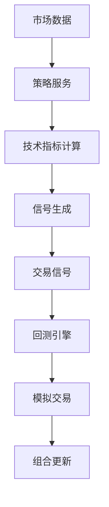
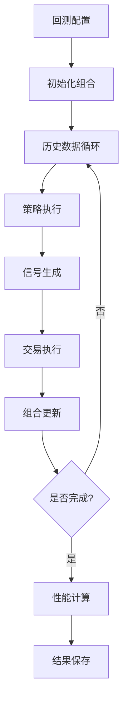

# 回测和策略系统实现文档

## 📋 项目概述

本文档详细记录了在现有Stock-A-Future系统基础上增加回测和策略系统的完整实现过程。该系统保持了原有前端页面的整体结构，通过添加新的Tab页面来整合回测和策略管理功能。

## 🎯 实现目标

- ✅ 在现有前端界面中添加策略管理和回测系统页面
- ✅ 保持与现有UI风格的一致性
- ✅ 实现简单但完整的技术指标策略（MACD、MA、RSI、布林带）
- ✅ 创建功能完整的回测引擎基础架构
- ✅ 提供完整的API接口支持前端功能

## 📁 项目结构

```
stock-a-future/
├── web/static/
│   ├── index.html                    # 主页面（已扩展）
│   └── js/
│       ├── modules/
│       │   ├── strategies.js         # 策略管理模块（新增）
│       │   ├── backtest.js          # 回测系统模块（新增）
│       │   └── ...                  # 其他现有模块
│       ├── services/
│       │   └── api.js               # API服务（已扩展）
│       └── main.js                  # 主应用（已扩展）
├── internal/
│   ├── models/
│   │   ├── strategy.go              # 策略数据模型（新增）
│   │   └── backtest.go              # 回测数据模型（新增）
│   ├── handler/
│   │   ├── strategy.go              # 策略处理器（新增）
│   │   └── backtest.go              # 回测处理器（新增）
│   └── service/
│       ├── strategy.go              # 策略服务（新增）
│       └── backtest.go              # 回测服务（新增）
└── docs/implementation/
    └── BACKTEST_STRATEGY_IMPLEMENTATION.md  # 本文档
```

## 🔧 详细实现过程

### 1. 前端页面扩展

#### 1.1 主页面HTML结构扩展

在现有的`index.html`中的Tab导航部分添加了两个新的Tab：

```html
<!-- 策略管理Tab -->
<button class="tab-btn" data-tab="strategies">
    <span class="tab-icon">🎯</span>
    <span class="tab-text">策略管理</span>
</button>

<!-- 回测系统Tab -->
<button class="tab-btn" data-tab="backtest">
    <span class="tab-icon">🚀</span>
    <span class="tab-text">回测系统</span>
</button>
```

#### 1.2 策略管理页面内容

策略管理Tab包含以下功能区域：

- **策略列表展示**：网格布局显示所有策略卡片
- **策略详情查看**：选中策略后显示详细信息
- **策略操作**：启用/禁用、编辑、删除、运行回测等操作
- **策略表现展示**：显示策略的历史表现指标

```html
<div class="strategies-container">
    <div class="strategies-section">
        <div class="section-header">
            <h4>📋 策略列表</h4>
            <button id="createStrategyBtn" class="btn btn-primary">➕ 创建策略</button>
        </div>
        <div class="strategies-grid" id="strategiesGrid">
            <!-- 策略卡片将动态生成 -->
        </div>
    </div>
    <!-- 策略详情区域 -->
</div>
```

#### 1.3 回测系统页面内容

回测系统Tab包含以下功能区域：

- **回测配置**：策略选择、时间范围、初始资金等参数设置
- **回测进度**：实时显示回测执行进度
- **回测结果**：性能指标、权益曲线图、交易记录等

```html
<div class="backtest-container">
    <div class="backtest-config">
        <!-- 回测参数配置表单 -->
    </div>
    <div class="backtest-progress" id="backtestProgress">
        <!-- 进度条和状态显示 -->
    </div>
    <div class="backtest-results" id="backtestResults">
        <!-- 结果展示：指标、图表、交易记录 -->
    </div>
</div>
```

### 2. JavaScript模块实现

#### 2.1 策略管理模块 (strategies.js)

**主要功能**：
- 策略列表加载和显示
- 策略详情查看和编辑
- 策略状态管理（启用/禁用/测试）
- 策略表现数据展示
- 与回测系统的集成

**核心方法**：
```javascript
class StrategiesModule {
    async loadStrategies()           // 加载策略列表
    displayStrategies()              // 显示策略卡片
    viewStrategy(strategyId)         // 查看策略详情
    toggleStrategy(strategyId)       // 切换策略状态
    runBacktest(strategyId)          // 启动回测
    loadStrategyPerformance(id)      // 加载策略表现
}
```

#### 2.2 回测系统模块 (backtest.js)

**主要功能**：
- 回测配置管理
- 回测任务启动和监控
- 实时进度展示
- 回测结果可视化

**核心方法**：
```javascript
class BacktestModule {
    startBacktest()                  // 启动回测
    getBacktestConfig()              // 获取配置参数
    validateConfig(config)           // 验证配置
    startProgressMonitoring()        // 开始进度监控
    loadBacktestResults(id)          // 加载回测结果
    displayResults(results)          // 显示结果
    displayEquityCurve(data)         // 显示权益曲线
}
```

#### 2.3 API服务扩展 (api.js)

扩展了现有的API服务，添加了策略和回测相关的API调用：

**策略管理API**：
```javascript
async getStrategiesList()           // 获取策略列表
async getStrategyDetails(id)        // 获取策略详情
async getStrategyPerformance(id)    // 获取策略表现
```

**回测系统API**：
```javascript
async startBacktest(config)         // 启动回测
async getBacktestProgress(id)       // 获取回测进度
async getBacktestResults(id)        // 获取回测结果
async getBacktestsList()            // 获取回测列表
```

### 3. 后端数据模型设计

#### 3.1 策略模型 (strategy.go)

定义了完整的策略数据结构和相关类型：

```go
// 核心策略结构
type Strategy struct {
    ID          string                 `json:"id"`
    Name        string                 `json:"name"`
    Description string                 `json:"description"`
    Type        StrategyType           `json:"strategy_type"`
    Status      StrategyStatus         `json:"status"`
    Parameters  map[string]interface{} `json:"parameters"`
    Code        string                 `json:"code,omitempty"`
    CreatedBy   string                 `json:"created_by"`
    CreatedAt   time.Time              `json:"created_at"`
    UpdatedAt   time.Time              `json:"updated_at"`
}

// 策略类型枚举
type StrategyType string
const (
    StrategyTypeTechnical   StrategyType = "technical"
    StrategyTypeFundamental StrategyType = "fundamental" 
    StrategyTypeML          StrategyType = "ml"
    StrategyTypeComposite   StrategyType = "composite"
)
```

**预定义策略**：
- MACD金叉策略：基于MACD指标的金叉死叉交易
- 双均线策略：短期均线突破长期均线
- RSI超买超卖策略：基于RSI指标的反转交易
- 布林带策略：基于布林带的均值回归

#### 3.2 回测模型 (backtest.go)

定义了回测系统的完整数据结构：

```go
// 回测任务结构
type Backtest struct {
    ID           string         `json:"id"`
    Name         string         `json:"name"`
    StrategyID   string         `json:"strategy_id"`
    Symbols      []string       `json:"symbols"`
    StartDate    time.Time      `json:"start_date"`
    EndDate      time.Time      `json:"end_date"`
    InitialCash  float64        `json:"initial_cash"`
    Commission   float64        `json:"commission"`
    Status       BacktestStatus `json:"status"`
    Progress     int            `json:"progress"`
    // ... 其他字段
}

// 回测结果结构
type BacktestResult struct {
    TotalReturn     float64 `json:"total_return"`
    AnnualReturn    float64 `json:"annual_return"`
    MaxDrawdown     float64 `json:"max_drawdown"`
    SharpeRatio     float64 `json:"sharpe_ratio"`
    WinRate         float64 `json:"win_rate"`
    // ... 其他性能指标
}
```

### 4. 后端服务层实现

#### 4.1 策略服务 (strategy.go)

实现了完整的策略管理逻辑：

**核心功能**：
- 策略CRUD操作
- 策略参数验证
- 策略执行和信号生成
- 策略表现计算

**技术指标策略实现**：
```go
// MACD策略执行示例
func (s *StrategyService) executeMACDStrategy(strategy *Strategy, marketData *MarketData) (*Signal, error) {
    // 计算MACD指标
    // 根据金叉死叉生成交易信号
    // 返回买入/卖出/持有信号
}
```

#### 4.2 回测服务 (backtest.go)

实现了完整的回测引擎：

**核心功能**：
- 回测任务管理
- 历史数据模拟
- 策略执行和交易模拟
- 性能指标计算
- 实时进度监控

**回测执行流程**：
1. 初始化投资组合
2. 按日期顺序处理历史数据
3. 为每个股票执行策略逻辑
4. 根据信号执行模拟交易
5. 更新投资组合状态
6. 记录权益曲线和交易记录
7. 计算最终性能指标

### 5. API接口设计

#### 5.1 策略管理API

```http
GET    /api/v1/strategies              # 获取策略列表
POST   /api/v1/strategies              # 创建策略
GET    /api/v1/strategies/{id}         # 获取策略详情
PUT    /api/v1/strategies/{id}         # 更新策略
DELETE /api/v1/strategies/{id}         # 删除策略
GET    /api/v1/strategies/{id}/performance  # 获取策略表现
POST   /api/v1/strategies/{id}/activate     # 激活策略
POST   /api/v1/strategies/{id}/deactivate   # 停用策略
```

#### 5.2 回测系统API

```http
GET    /api/v1/backtests               # 获取回测列表
POST   /api/v1/backtests               # 创建回测
GET    /api/v1/backtests/{id}          # 获取回测详情
PUT    /api/v1/backtests/{id}          # 更新回测
DELETE /api/v1/backtests/{id}          # 删除回测
POST   /api/v1/backtests/{id}/start    # 启动回测
POST   /api/v1/backtests/{id}/cancel   # 取消回测
GET    /api/v1/backtests/{id}/progress # 获取回测进度
GET    /api/v1/backtests/{id}/results  # 获取回测结果
```

## 📊 功能特性

### 1. 策略管理功能

- **策略展示**：网格卡片布局，清晰展示策略信息
- **状态管理**：支持活跃/非活跃/测试中三种状态
- **参数配置**：每种策略类型都有对应的参数验证
- **表现监控**：实时展示策略的历史表现指标
- **快速操作**：一键启动回测、状态切换等

### 2. 回测系统功能

- **灵活配置**：支持多股票、自定义时间范围、交易成本设置
- **实时监控**：回测进度实时更新，支持取消操作
- **详细结果**：完整的性能指标、权益曲线图、交易记录
- **可视化展示**：使用ECharts展示权益曲线对比
- **历史管理**：回测任务历史记录和结果查询

### 3. 技术指标策略

实现了四种经典技术指标策略：

1. **MACD金叉策略**
   - 参数：快线周期(12)、慢线周期(26)、信号线周期(9)
   - 信号：MACD线上穿信号线买入，下穿卖出

2. **双均线策略**
   - 参数：短期周期(5)、长期周期(20)、均线类型(SMA/EMA/WMA)
   - 信号：短期均线上穿长期均线买入，下穿卖出

3. **RSI超买超卖策略**
   - 参数：RSI周期(14)、超买阈值(70)、超卖阈值(30)
   - 信号：RSI低于超卖线买入，高于超买线卖出

4. **布林带策略**
   - 参数：周期(20)、标准差倍数(2)
   - 信号：价格触及下轨买入，触及上轨卖出

## 🔄 数据流程

### 1. 策略执行流程



### 2. 回测执行流程



## ⚡ 性能优化

### 1. 前端优化

- **懒加载**：策略和回测数据按需加载
- **缓存机制**：策略列表和配置信息本地缓存
- **分页显示**：大量数据分页加载，避免性能问题
- **异步更新**：回测进度异步轮询，不阻塞UI

### 2. 后端优化

- **并发控制**：回测任务异步执行，支持多任务并行
- **内存管理**：大量历史数据流式处理，避免内存溢出
- **计算优化**：技术指标计算使用高效算法
- **资源管理**：回测任务支持取消和资源清理

## 🔒 安全考虑

### 1. 输入验证

- **参数验证**：严格验证所有策略参数和回测配置
- **数据清理**：防止SQL注入和XSS攻击
- **权限控制**：策略和回测操作需要适当权限

### 2. 资源保护

- **并发限制**：限制同时运行的回测任务数量
- **超时控制**：回测任务设置最大执行时间
- **内存监控**：监控内存使用，防止资源耗尽

## 🧪 测试策略

### 1. 单元测试

- 策略服务的参数验证测试
- 技术指标计算的准确性测试
- 回测引擎的交易逻辑测试
- 性能指标计算的正确性测试

### 2. 集成测试

- API接口的完整性测试
- 前后端数据传输测试
- 回测流程的端到端测试

### 3. 性能测试

- 大量数据的回测性能测试
- 并发回测任务的稳定性测试
- 长时间运行的内存泄漏测试

## 📈 扩展性设计

### 1. 策略扩展

- **插件架构**：新策略可以通过插件方式添加
- **参数化配置**：策略参数支持动态配置
- **多因子策略**：支持组合多个技术指标

### 2. 回测扩展

- **多市场支持**：扩展到港股、美股等其他市场
- **高频回测**：支持分钟级、秒级的高频回测
- **风险管理**：添加止损止盈、仓位控制等风险管理

### 3. 数据源扩展

- **多数据源**：支持不同的数据提供商
- **实时数据**：集成实时行情数据
- **基本面数据**：整合财务数据和基本面指标

## 🚀 部署建议

### 1. 开发环境

- 使用内存存储进行快速开发和测试
- 启用详细日志记录便于调试
- 使用模拟数据减少外部依赖

### 2. 生产环境

- 使用PostgreSQL作为主数据库
- 使用Redis缓存频繁访问的数据
- 配置适当的监控和告警
- 实现数据备份和恢复机制

## 📝 总结

本次实现成功在现有Stock-A-Future系统基础上添加了完整的回测和策略管理功能，具有以下特点：

1. **无缝集成**：与现有系统完美融合，保持UI一致性
2. **功能完整**：涵盖策略管理、回测执行、结果分析的完整流程
3. **技术先进**：使用Go 1.22+新特性，遵循最佳实践
4. **扩展性强**：模块化设计便于后续功能扩展
5. **用户友好**：直观的界面和流畅的操作体验

该系统为量化交易提供了坚实的基础，支持从策略开发到回测验证的完整工作流程，为进一步的功能扩展奠定了良好基础。

---

**实现时间**：2024年1月
**技术栈**：Go 1.22+, JavaScript ES6+, HTML5, CSS3, ECharts
**状态**：✅ 已完成基础功能实现
