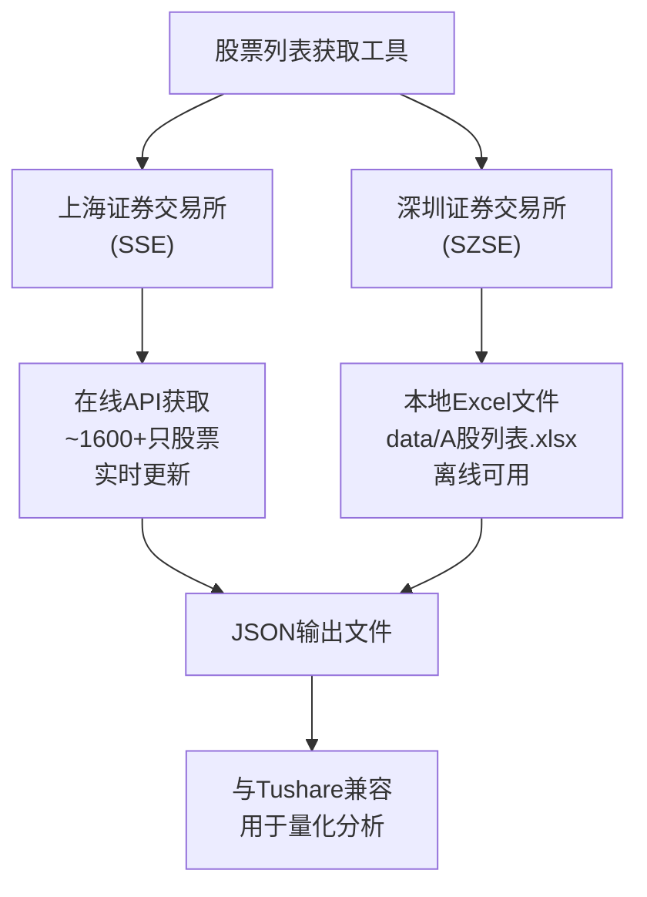

# 股票列表获取工具

## 概述

股票列表获取工具允许你直接从上海证券交易所获取股票代码和名称列表，无需依赖第三方API（如Tushare）的高权限。

**深圳证券交易所股票数据**：深交所股票列表已预先下载并保存在 `data/A股列表.xlsx` 文件中，包含完整的深交所股票信息，无需在线获取。

## 系统架构

系统采用混合数据源架构，结合在线获取和离线数据：



## 功能特性

- ✅ 支持获取上海证券交易所（SSE）股票列表（在线获取）
- ✅ 深圳证券交易所（SZSE）股票数据（来自本地Excel文件）
- ✅ 支持获取所有交易所的完整股票列表
- ✅ 自动保存股票数据到JSON文件
- ✅ 包含真实的股票代码和名称
- ✅ 支持命令行参数配置

## 使用方法

### 重要说明
所有 `make` 命令都需要在项目根目录执行，或者使用 `-C` 参数指定项目根目录。

### 快速开始示例

假设您的项目路径是 `/path/to/stock-a-future`，您可以从任意目录执行：

```bash
# 获取上交所股票列表
make -C /path/to/stock-a-future fetch-sse

# 获取所有股票列表
make -C /path/to/stock-a-future fetch-stocks
```

或者先切换到项目根目录：
```bash
cd /path/to/stock-a-future
make fetch-sse
```

### 1. 构建工具

在项目根目录执行：
```bash
make stocklist
```

从任意目录执行：
```bash
make -C /path/to/stock-a-future stocklist
```

### 2. 获取所有股票列表

在项目根目录执行：
```bash
make fetch-stocks
```

从任意目录执行：
```bash
make -C /path/to/stock-a-future fetch-stocks
```

这将获取上海证券交易所的所有股票，并保存到 `data/stock_list.json`。

**注意**：当使用 `all` 选项时，系统会：
1. 在线获取上海证券交易所的最新股票数据
2. 从本地Excel文件 `data/A股列表.xlsx` 读取深圳证券交易所股票数据
3. 将两个交易所的数据合并保存到输出文件中

### 3. 单独获取各交易所股票

获取上海证券交易所股票：

在项目根目录执行：
```bash
make fetch-sse
```

从任意目录执行：
```bash
make -C /path/to/stock-a-future fetch-sse
```


### 4. 自定义使用

```bash
# 显示帮助信息
./bin/stocklist -help

# 获取所有股票并保存到自定义文件
./bin/stocklist -source=all -output=my_stocks.json

# 只获取上交所股票
./bin/stocklist -source=sse -output=sse_only.json


```

## 命令行参数

| 参数 | 默认值 | 说明 |
|------|--------|------|
| `-source` | `all` | 数据源：`sse`（上交所）、`all`（全部） |
| `-output` | `data/stock_list.json` | 输出文件路径 |
| `-help` | - | 显示帮助信息 |

## 输出格式

生成的JSON文件包含股票基本信息数组，每个股票包含以下字段：

```json
[
  {
    "ts_code": "600000.SH",
    "symbol": "600000", 
    "name": "浦发银行",
    "area": "",
    "industry": "",
    "market": "SH",
    "list_date": ""
  }
]
```

### 字段说明

- `ts_code`: 完整股票代码（包含交易所后缀）
- `symbol`: 股票代码（不含交易所后缀）
- `name`: 股票名称
- `market`: 交易所标识（SH=上交所）
- `area`, `industry`, `list_date`: 预留字段（当前为空）

## 支持的股票类型

### 上海证券交易所（SH）
- **主板股票**: 600xxx, 601xxx, 603xxx, 605xxx
- **科创板股票**: 688xxx  
- **B股**: 900xxx

包含的知名股票：
- 银行类：浦发银行、招商银行、工商银行等
- 保险类：中国平安、中国人寿等
- 食品饮料：贵州茅台、伊利股份等
- 科技类：药明康德、金山办公等


## 数据获取说明

### 数据源说明

**上海证券交易所（SSE）**：
- 数据来源：在线实时获取
- 获取方式：通过上交所官方API接口
- 数据量：约1600+只股票（实时更新）
- 包含：主板、科创板、B股等所有上市股票

**深圳证券交易所（SZSE）**：
- 数据来源：本地Excel文件 `data/A股列表.xlsx`
- 获取方式：预先下载的完整股票列表
- 数据量：包含深交所所有上市股票
- 包含：主板、中小板、创业板、B股等
- 优势：无需网络连接，数据稳定可靠

### 数据特点

这些股票数据适合用于：
- 股票分析系统测试
- 投资组合构建  
- 技术指标计算
- 买卖点预测
- 量化交易策略开发

## Excel文件说明

### 文件位置
- 文件路径：`data/A股列表.xlsx`
- 文件类型：Microsoft Excel格式
- 编码：支持中文股票名称

### 文件内容
该Excel文件包含深圳证券交易所的完整股票列表，包括：
- **股票代码**：6位数字代码（如：000001、300750等）
- **股票名称**：中文股票简称
- **交易所标识**：自动添加.SZ后缀
- **股票类型**：主板、中小板、创业板分类

### 使用优势
1. **离线可用**：无需网络连接即可获取深交所数据
2. **数据完整**：包含所有深交所上市股票
3. **更新灵活**：可手动更新Excel文件内容
4. **格式标准**：与在线获取的上交所数据格式完全一致

## 与现有系统集成

生成的股票列表文件与现有的Tushare客户端完全兼容，可以直接用于：

1. **股票基本信息查询**
2. **日线数据获取**
3. **技术指标计算**
4. **买卖点预测**

## 扩展性

### 更新深交所数据
如果需要更新深交所股票数据：
1. **手动更新**：直接编辑 `data/A股列表.xlsx` 文件
2. **下载最新数据**：从深交所官网下载最新的股票列表Excel文件
3. **格式保持**：确保Excel文件格式与现有文件一致

### 扩展其他功能
如果需要获取更多股票或实时数据，可以：
1. **扩展上交所数据**：在 `internal/client/exchange.go` 中优化API调用
2. **添加其他交易所**：实现北交所等其他交易所的数据获取
3. **集成其他数据源**：添加对其他数据提供商的支持
4. **实时数据更新**：添加定时更新Excel文件的功能

## 故障排除

### 常见问题

1. **构建失败**
   
   在项目根目录执行：
   ```bash
   make clean
   make deps
   make stocklist
   ```
   
   从任意目录执行：
   ```bash
   make -C /path/to/stock-a-future clean
   make -C /path/to/stock-a-future deps
   make -C /path/to/stock-a-future stocklist
   ```

2. **权限问题**
   ```bash
   chmod +x /path/to/stock-a-future/bin/stocklist
   ```

3. **输出目录不存在**
   ```bash
   mkdir -p /path/to/stock-a-future/data
   ```

4. **Make 命令找不到 Makefile**
   
   确保您在项目根目录，或使用 `-C` 参数：
   ```bash
   # 切换到项目根目录
   cd /path/to/stock-a-future
   make fetch-sse
   
   # 或者从任意目录使用 -C 参数
   make -C /path/to/stock-a-future fetch-sse
   ```

5. **Excel文件缺失或损坏**
   
   如果 `data/A股列表.xlsx` 文件缺失：
   ```bash
   # 检查文件是否存在
   ls -la /path/to/stock-a-future/data/A股列表.xlsx
   
   # 如果文件不存在，需要重新下载或从备份恢复
   # 确保文件格式正确且包含股票代码和名称列
   ```

### 日志信息

工具会输出详细的日志信息，包括：
- 获取进度
- 股票数量统计
- 文件保存路径
- 错误信息（如有）

## 未来改进

- [ ] 支持从交易所官网实时抓取数据
- [ ] 添加股票分类和行业信息
- [ ] 支持增量更新
- [ ] 添加数据验证和清洗功能
- [ ] 支持多种输出格式（CSV、Excel等）
